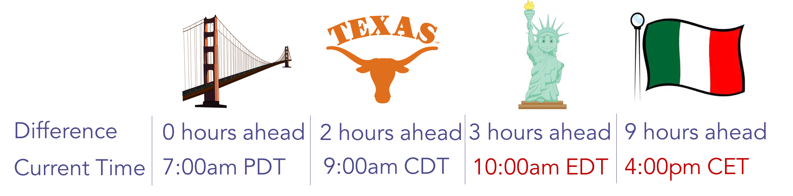

# 按收件人时区计划电子邮件程序 {#schedule-email-programs-with-recipient-time-zone}

在启用“收件人时区”的情况下计划电子邮件程序时，可能会出现以下两种情况：

1. 计划运行程序 **范围** 接下来的25小时
1. 计划运行程序 **更多** 未来25小时内（即下周）

## 场景1:25小时内 {#scenario-within-hours}

假设您批准启用了收件人时区的电子邮件计划，并计划在未来25小时内完成投放。 您的智能列表中可能包含居住在计划时间已过的时区的人员。

在此场景中，我们允许您决定如何处理此合格人员的子集。 单击旁边的齿轮图标 **收件人时区** 在 **计划** 电子邮件程序的磁贴。

这为您提供了两个选项：

>[!NOTE]
>
>**条件**
>
>* **按照收件人的时区交付第二天**：如果电子邮件计划于星期二上午9:00发出，则居住在计划时间已过的时区的合格人员将收到电子邮件 *星期三* 上午9点。
>
>* **使用程序的默认设置时间投放**：如果电子邮件计划于星期二上午9:00发出，则居住在已过计划时间的时区的符合条件人员将收到电子邮件 _基于您的订阅时区设置_. 那么，如果 [订阅时区设置](/help/marketo/product-docs/administration/settings/select-your-language-locale-and-time-zone.md) 设置为美国太平洋夏令时间/洛杉矶，这些收件人仍将在星期二上午9:00（太平洋夏令时间）收到电子邮件（无论时间位于他们自己的时区）。

>[!NOTE]
>
>[了解详情](/help/marketo/product-docs/email-marketing/email-programs/email-program-actions/scheduling-with-recipient-time-zone/understanding-recipient-time-zone.md#calculating-time-zone) 关于Marketo如何计算收件人的时区。

让我们更详细地考虑此方案。 假设您位于旧金山，计划于早上7点发送电子邮件给 **上午9:00** 发送。 在您的智能列表中，有下列地区的人员：

* 旧金山
* 得克萨斯州
* 纽约
* 意大利

纽约和意大利已经过了上午9点，因此这两个时区的合格人员将收到基于 **时区设置**：

* **按照收件人的时区交付以下日期：** 星期三上午9点，他们各自的时区， **或**

* **使用程序的默认设置时间投放**：星期二上午9:00太平洋夏令时间（纽约 — 中午12:00东部夏令时间和意大利 — 下午6:00中部夏令时间）。

批准程序后，它将在15分钟内开始运行。

>[!NOTE]
>
>尽管该计划将启动 _进程_ 在15分钟内发送电子邮件，则电子邮件不会 _已投放_ 就在那时。 收件人仍会收到基于 **时区设置** 你自己选择。

## 场景2：超过25小时 {#scenario-more-than-hours}

在第二种方案中，您批准一个电子邮件程序，具有 **收件人时区** 启用并且计划的提交时间在未来25小时以上。 在这种情况下，程序将在中的计划时间开始运行 **最早** 世界时区(UTC + 14:00)。 全球每个时区都可能有符合您的智能列表资格的人员，因此从最早的时区开始，我们便可以在计划日期/时间将电子邮件发送给其各自时区中的所有收件人。

**头开始**

现在，我们来讨论一下 [头开始](/help/marketo/product-docs/email-marketing/email-programs/email-program-actions/head-start-for-email-programs.md) 适用于 **收件人时区**. 我们现有的先发制人功能要求项目至少提前12小时计划。 那么这对收件人时区意味着什么？ 请记住，启用收件人时区后，我们将在最早时区的计划时间开始运行电子邮件程序(UTC +14:00)。 因此，要启用 **两者** “开始时间”和“收件人时区”，需要计划电子邮件程序 **至少比计划时间提前12小时(UTC +14:00)。**

这意味着如果您在美国/洛杉矶并且希望同时启用开始时间和收件人时区，则需要安排该计划 **34小时** 事前准备。 我们怎么找到这个号码的？

  

简而言之，使用收件人时区计划的电子邮件程序需要在最早时区的计划时间（即首先到达午夜）开始运行，以适应每个时区。 因此，如果您计划电子邮件项目……

* **具有投放时间 _范围_ 25小时**，程序将在15分钟内开始运行。 已超过计划时间的收件人将根据您选择的时区设置收到电子邮件。
* **具有投放时间 _大于_ 未来25小时**，程序将在最早时区的计划时间开始运行(UTC +14:00)。
* **具有头开始**&#x200B;时，程序将在最早时区(UTC +14:00)中的计划时间之前12小时开始处理。

>[!CAUTION]
>
>在您开始发送电子邮件到实际发送电子邮件之间取消订阅的任何人，仍将收到该电子邮件。 我们建议调整您的取消订阅通知，以反映取消订阅可能需要1-2个工作日才能处理。

>[!MORELIKETHIS]
>
>* [了解收件人时区](/help/marketo/product-docs/email-marketing/email-programs/email-program-actions/scheduling-with-recipient-time-zone/understanding-recipient-time-zone.md)
>* [电子邮件程序快速入门](/help/marketo/product-docs/email-marketing/email-programs/email-program-actions/head-start-for-email-programs.md)
>* [中止按收件人时区计划的电子邮件项目投放](/help/marketo/product-docs/email-marketing/email-programs/email-program-actions/scheduling-with-recipient-time-zone/abort-delivery-of-email-programs-scheduled-with-recipient-time-zone.md)
