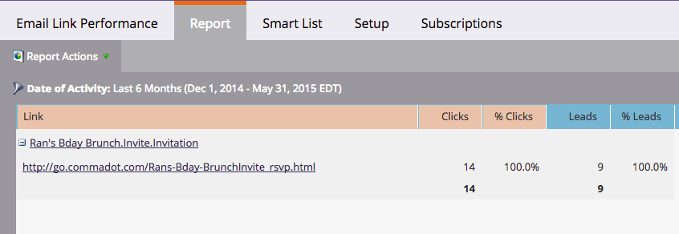

# 电子邮件链接性能报表 {#email-link-performance-report}

创建电子邮件链接性能报表，以查看电子邮件中链接的表现如何。

1. [在项目中创建报告](/help/marketo/product-docs/reporting/basic-reporting/creating-reports/create-a-report-in-a-program.md) 并选择 **电子邮件链接性能** 作为报表类型。

   

1. 单击 **设置**.

   

1. 双击 **活动日期** 下 **设置**.

   

1. 为报表设置适当的时间范围。 单击 **保存**.

   

1. 单击 **报表**.

   

1. 太棒了！ 现在，您已创建一个电子邮件链接性能报表。

   

[可用列](/help/marketo/product-docs/reporting/basic-reporting/editing-reports/select-report-columns.md) 电子邮件链接性能报表包括：

<table> 
 <thead> 
  <tr> 
   <th colspan="1" rowspan="1">列</th> 
   <th colspan="1" rowspan="1">描述</th> 
  </tr> 
 </thead> 
 <tbody> 
  <tr> 
   <td colspan="1" rowspan="1">链接</td> 
   <td colspan="1" rowspan="1">按电子邮件名称分组。 单击加号(+)可查看该电子邮件包含的所有链接。</td> 
  </tr> 
  <tr> 
   <td colspan="1" rowspan="1">单击次数</td> 
   <td colspan="1" rowspan="1">单击该链接的次数。</td> 
  </tr> 
  <tr> 
   <td colspan="1" rowspan="1">% 单击次数</td> 
   <td colspan="1" rowspan="1">在该电子邮件中所有链接的总点击次数中，此链接所占的百分比。</td> 
  </tr> 
  <tr> 
   <td colspan="1" rowspan="1">人员</td> 
   <td colspan="1" rowspan="1">点击链接的独特访客数。</td> 
  </tr> 
  <tr> 
   <td colspan="1" rowspan="1">% 人员</td> 
   <td colspan="1" rowspan="1">在该电子邮件中点击链接的总独特访客中，此链接所占的百分比。</td> 
  </tr> 
 </tbody> 
</table>

>[!NOTE]
>
>向电子邮件添加无效/空链接时，此报表将显示“格式错误的链接”。 如果您看到此消息， [检查HTML源](/help/marketo/product-docs/email-marketing/general/functions-in-the-editor/edit-an-emails-html.md) 在电子邮件编辑器中查找未填充完整链接的空链接或令牌。

>[!TIP]
>
>如果你想知道某个人到底做了什么，你可以打开 [活动日志](/help/marketo/product-docs/core-marketo-concepts/smart-lists-and-static-lists/managing-people-in-smart-lists/filter-activity-types-in-the-activity-log-of-a-person.md) 在 [人员详细信息](/help/marketo/product-docs/core-marketo-concepts/smart-lists-and-static-lists/managing-people-in-smart-lists/using-the-person-detail-page.md) 页面。

>[!MORELIKETHIS]
>
>* [电子邮件性能报表](/help/marketo/product-docs/email-marketing/email-programs/email-program-data/email-performance-report.md)
>* [在电子邮件报表中筛选资源](/help/marketo/product-docs/reporting/basic-reporting/report-activity/filter-assets-in-an-email-report.md)
