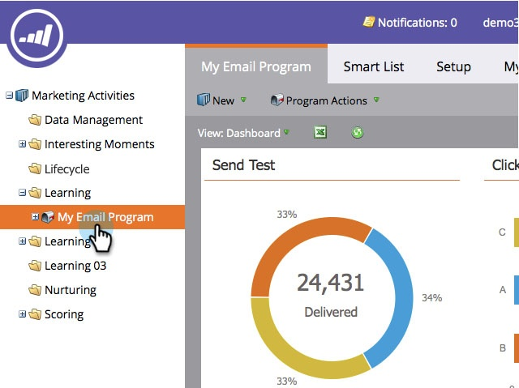
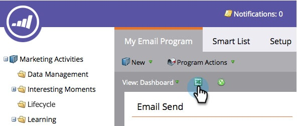

# 将电子邮件项目仪表板导出到 Excel {#export-email-program-dashboard-to-excel}

运行电子邮件程序并在功能板中显示一些数据后，您可以将该原始数据导出到Excel以供进一步分析。 操作方法如下：

1. 前往 **[!UICONTROL Marketing Activities]**。

   

1. 查找并选择您的电子邮件程序。

   

   >[!NOTE]
   >
   >如果您的电子邮件程序尚未开始，您将看不到仪表板，因为没有要查看的数据。

1. 只需单击Excel图标，即可开始导出。

   

   很简单，对吧？
