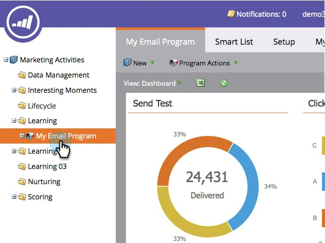

# 将电子邮件程序功能板导出到Excel {#export-email-program-dashboard-to-excel}

运行电子邮件程序并在功能板中包含一些数据后，可将该原始数据导出到excel以供进一步分析。 这是方法。

1. 转到 **营销活动**.

   

1. 查找并选择您的电子邮件程序。

   

   >[!NOTE]
   >
   >如果您的电子邮件程序尚未开始，您将看不到功能板，因为没有可查看的数据。

1. 只需单击Excel图标，即可开始导出。

   

   很简单，对吧？
