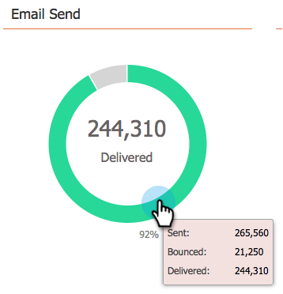

# 使用电子邮件程序仪表板 {#use-the-email-program-dashboard}

查看您的电子邮件程序在此仪表板视图中的执行情况。

>[!NOTE]
>
>如果您的程序进行了A/B测试，请查看 [电子邮件计划仪表板 — A/B测试视图](/help/marketo/product-docs/email-marketing/email-programs/email-program-actions/email-test-a-b-test/use-the-email-program-dashboard-a-b-test-view.md).

>[!NOTE]
>
>此视图中的所有数据都是汇总数据（包括A/B测试以及最终的电子邮件发送）。

## 电子邮件发送 {#email-send}

在这里，您可以看到已发送、退回和投放的电子邮件数量。

>[!NOTE]
>
>由于电子邮件可投放性标准超出Marketo的控制范围，因此“已退回”和“已投放”状态只是近似值，不精确。

## 打开/点击次数 {#opens-clicks}

此图表显示运行电子邮件程序后特定时间段内打开/点击的电子邮件数量。

>[!TIP]
>
>请注意打开/点击次数如何随时间而减少。

## 摘要 — 参与度 {#summary-engagement}

这向您展示了整个 [参与度分数](/help/marketo/product-docs/email-marketing/drip-nurturing/reports-and-notifications/understanding-the-engagement-score.md).

## 摘要 — Rest {#summary-rest}

其余数据将显示打开次数、点击次数、点击/打开率和取消订阅次数。

>[!TIP]
>
>此 **取消订阅** 上例中的比率非常小，Marketo放大以更好地查看。 栏中的第二个数字只是为了缩放而添加的。

>[!NOTE]
>
>**条件**
>
>**打开次数** 当电子邮件收件人下载电子邮件的图像(包括插入Marketo的跟踪像素)时，会计入该数量。 如果收件人查看了电子邮件，但选择不下载其图像，则不会将其计为已打开。 如果图像在收件人的预览窗格中加载，则通常将被计为打开图像，但实际打开图像的情况因电子邮件客户端而异。
>
>**单击以打开** 测量在电子邮件中同时打开和点击了链接的电子邮件的百分比。 我们取唯一点击数除以唯一打开数，然后乘以100以百分比形式显示。

## 刷新仪表板 {#refresh-dashboard}

要查看最新数据，只需单击功能板上的刷新图标。

>[!MORELIKETHIS]
>
>[使用电子邮件程序仪表板 — A/B测试视图](/help/marketo/product-docs/email-marketing/email-programs/email-program-actions/email-test-a-b-test/use-the-email-program-dashboard-a-b-test-view.md)
