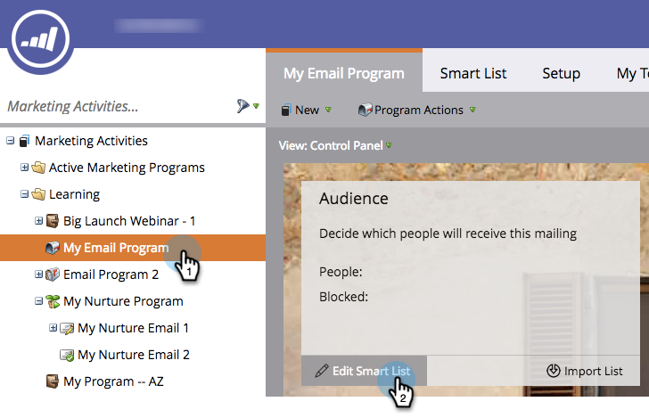

# 使用智能列表定义受众 {#define-an-audience-with-a-smart-list}

一旦 [创建电子邮件程序](/help/marketo/product-docs/email-marketing/email-programs/creating-an-email-program/create-an-email-program.md)，则您会希望告诉向其发送电子邮件的用户。 您可以通过 [导入人员列表](/help/marketo/product-docs/email-marketing/email-programs/managing-people-in-email-programs/define-an-audience-by-importing-a-list.md) 或者是智能列表。 下面是如何通过智能列表来实现此目的。

>[!PREREQUISITES]
>
>[创建电子邮件程序](/help/marketo/product-docs/email-marketing/email-programs/creating-an-email-program/create-an-email-program.md)

>[!NOTE]
>
>只有在电子邮件程序未获批准时，才能定义受众。

1. 转到 **营销活动**.

   

1. 选择您的电子邮件程序，然后单击 **编辑智能列表** 下 **受众** 拼贴。

   

   >[!TIP]
   >
   >确保将视图设置为 **控制面板** 来查找此设置。

1. 找到要使用的过滤器，并将其拖到画布中。

   

1. 定义过滤器。

   

1. 添加和定义过滤器后，返回主程序选项卡。 您将看到有多少人符合条件。

   

   干得好！ 现在该 [选择现有电子邮件](/help/marketo/product-docs/email-marketing/email-programs/email-program-actions/choose-an-existing-email.md) 或 [创建电子邮件](/help/marketo/product-docs/email-marketing/email-programs/email-program-actions/create-an-email-for-an-email-program.md) 送给这些人。

>[!NOTE]
>
>**条件**
>
>你注意到被阻止的号码了吗？ 此数字是符合条件的人员的子集，表示无法发送此电子邮件的人员，因为他们是：
>
>* 退订
>* 营销暂停
>* 列入阻止列表
>* 电子邮件无效
>* 空电子邮件
>
>单击号码可查看阻止发送邮件的详细人员列表。 **请注意：** 运营电子邮件仍会发送给标记为未订阅和营销暂停的用户。
>
>使用  按钮，以查看将收到电子邮件的人数。

>[!MORELIKETHIS]
>
>* [选择现有电子邮件](/help/marketo/product-docs/email-marketing/email-programs/email-program-actions/choose-an-existing-email.md)
>* [为电子邮件程序创建电子邮件](/help/marketo/product-docs/email-marketing/email-programs/email-program-actions/create-an-email-for-an-email-program.md)

