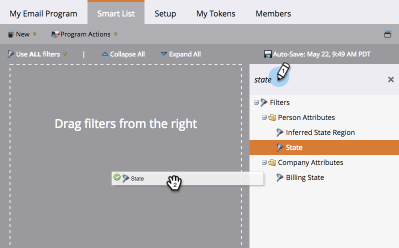

# 使用智能受众{#define-an-audience-with-a-smart-list}定义列表

在[创建电子邮件项目](../../../../product-docs/email-marketing/email-programs/creating-an-email-program/create-an-email-program.md)后，您将希望告诉它要将电子邮件发送给谁。 可通过[导入人员](define-an-audience-by-importing-a-list.md)的列表或使用智能列表来执行此操作。 下面介绍如何通过智能列表实现此目标。

>[!PREREQUISITES]
>
>* [创建电子邮件项目](../../../../product-docs/email-marketing/email-programs/creating-an-email-program/create-an-email-program.md)

>

>[!NOTE]
>
>**提醒**
>
>只有在未批准电子邮件受众时，才能定义项目。

1. 转到&#x200B;**营销活动**。

   

1. 选择您的电子邮件项目，然后单击&#x200B;**受众**&#x200B;磁贴下的&#x200B;**编辑智能列表**。

   

   >[!TIP]
   >
   >确保将视图设置为&#x200B;**控制面板**&#x200B;以查找此设置。

1. 找到要使用的滤镜并将其拖入画布。

   

1. 定义筛选器。

   

   >[!NOTE]
   >
   >**深潜**
   >
   >
   >了解[智能列表和静态列表](http://docs.marketo.com/display/docs/smart+lists+and+static+lists)，进一步了解如何使用和定义过滤器。

1. 添加和定义过滤器后，返回主项目选项卡。 您将看到有多少人符合资格。

   

   干得好！ 现在，是时候[选择现有电子邮件](../../../../product-docs/email-marketing/email-programs/email-program-actions/choose-an-existing-email.md)或[创建电子邮件](../../../../product-docs/email-marketing/email-programs/email-program-actions/create-an-email-for-an-email-program.md)发送给这些人了。

>[!NOTE]
>
>**定义**
>
>你注意到被阻止的号码了吗？ 此数字是合格人员的子集，代表无法发送此电子邮件的人员，因为他们：
>
>* 取消订阅
>* 营销已暂停
>* 列入阻止列表
>* 电子邮件无效
>* 空电子邮件

>
>
单击号码，详细列表邮件中阻止的人员。 **请注意：运** 营电子邮件仍将发送给标记为未订阅和营销暂停的用户。
>
>使用受众拼贴上的按钮，查看将收到电子邮件的人数。

>[!MORELIKETHIS]
>
>* [选择现有电子邮件](../../../../product-docs/email-marketing/email-programs/email-program-actions/choose-an-existing-email.md)
>* [创建电子邮件项目](../../../../product-docs/email-marketing/email-programs/email-program-actions/create-an-email-for-an-email-program.md)

>

