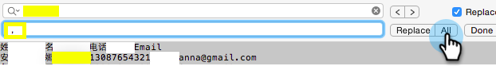

# 导入非拉丁字符列表 {#import-a-non-latin-characters-list}

尝试导入不是英语的文件？ 当您使用Excel打开列表时，该列表看起来非常完美。

但是，将其导入Marketo时，您可能会看到非英语字符被正确拾取。

这是因为文件未正确保存，以便Marketo识别所有非拉丁字符。 好消息是，您可以按照一些简单的步骤进行修复。

1. 选择 **另存为……** 从 **文件** 菜单。

   

1. 选择 **UTF-16 Unicode文本(.txt)** 作为 **格式** 选项。 这将采用Marketo显示文件的方式对文件进行编码。

   

   >[!NOTE]
   >
   >Marketo还支持UTF-8、Shift-JIS或EUC-JP。

1. Excel会将新文件另存为扩展名为.txt的文本文件。 但它也会将文件中的所有逗号转换为选项卡。 我们得把它换回来。

   >[!TIP]
   >
   >您可以使用 **记事本** 如果您使用的是Windows，或 **文本编辑** 如果您使用的是Mac。

   

1. 从文档中选择一个选项卡并复制它。

   

1. 选择 **查找并替换……** 从 **编辑** 菜单。

   

   >[!TIP]
   >
   >Windows用户的等效操作是： **编辑>替换……**

1. 将步骤4中复制的选项卡粘贴到第一个（要替换）框中，然后在第二个（替换为）框中键入逗号。 然后单击 **全部**.

   

1. 瞧，所有逗号都回来了，我们准备好了。

   

1. 将新文件导入Marketo，此时应正确显示该信息。

   

   >[!NOTE]
   >
   >正在导入的任何日期/时间字段都将被视为中央时间。 如果您的日期/时间字段位于不同的时区，则可以使用Excel公式将其转换为中部时间（美国/芝加哥）。

我们知道这很奇怪，但是很管用。 开心进口！
