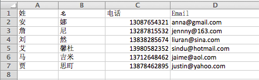

# 导入非拉丁字符列表 {#import-a-non-latin-characters-list}

尝试导入非英语文件？ 当您用Excel打开列表时，它看起来完美无缺。

但是，将其导入Marketo时，您可能会发现未正确提取非英语字符。

这是因为文件未正确保存，Marketo无法识别所有非拉丁字符。 好消息是，您可以遵循一些简单的步骤来修复此问题。

1. 选择 **另存为……** 从 **文件** 菜单。

   

1. 选择 **UTF-16 Unicode文本(.txt)** 作为 **格式** 选项。 这将按照Marketo显示文件的方式对文件进行编码。

   

   >[!NOTE]
   >
   >Marketo还支持UTF-8、Shift-JIS或EUC-JP。

1. Excel会将新文件另存为扩展名为.txt的文本文件。 但它也会将文件中的所有逗号转换为制表符。 我们需要把它改回来。

   >[!TIP]
   >
   >可以使用以下方式打开文本文件 **笔记本** 如果您使用的是Windows或 **文本编辑** 如果您使用的是Mac。

   

1. 从文档中选择一个选项卡并复制它。

   

1. 选择 **查找和替换……** 从 **编辑** 菜单。

   

   >[!TIP]
   >
   >对于Windows用户，等效操作为： **编辑>替换……**

1. 将您在步骤4中复制的选项卡粘贴到第一个（要替换的）框中，并在第二个（替换为）框中键入逗号。 然后单击 **全部**.

   

1. 好了，所有逗号都回来了，我们准备开动了。

   

1. 将新文件导入Marketo，此时信息应正确显示。

   

   >[!NOTE]
   >
   >正在导入的任何日期/时间字段都将被视为中部时间。 如果您的日期/时间字段位于不同的时区，则可以使用Excel公式将其转换为中部时间（美洲/芝加哥）。

我们知道这很奇怪，但行得通。 祝您进口顺利！
