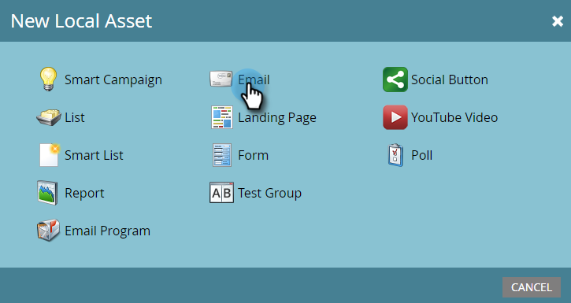

# 创建纯文本电子邮件 {#create-a-text-only-email}

如果您只想发送文本电子邮件，下面是如何创建无任何HTML内容发送的电子邮件。

>[!NOTE]
>
>由于打开由下载电子邮件图像（包括不可见的跟踪像素）的收件人跟踪，因此打开是 **非** 能够跟踪纯文本电子邮件。

1. 转到 **营销活动** 区域。

   

1. 选择您的项目，单击 **新建** 下拉并选择 **新建本地资产**.

   

1. 选择 **电子邮件**.

   

1. 输入 **名称**，选择模板并单击 **创建**.

   

1. 在电子邮件编辑器中，单击 **电子邮件设置**.

   

1. Check **仅限文本** 并单击 **保存**.

   

   >[!CAUTION]
   >
   >纯文本电子邮件不会自动跟踪链接。 了解如何 [将跟踪链接添加到文本电子邮件](/help/marketo/product-docs/email-marketing/general/functions-in-the-editor/add-tracked-links-to-a-text-email.md).

   >[!TIP]
   >
   >您还可以编辑现有电子邮件并更改此设置。 别忘了批准草案。

1. 取消选中 **自动从HTML复制** 复选框。

   

   >[!NOTE]
   >
   >在发送电子邮件时，添加到电子邮件HTML部分的任何内容都将被忽略。

1. 双击文本区域。

   

1. 编辑文本并单击 **保存**.

   

就这么简单。
