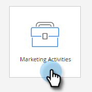
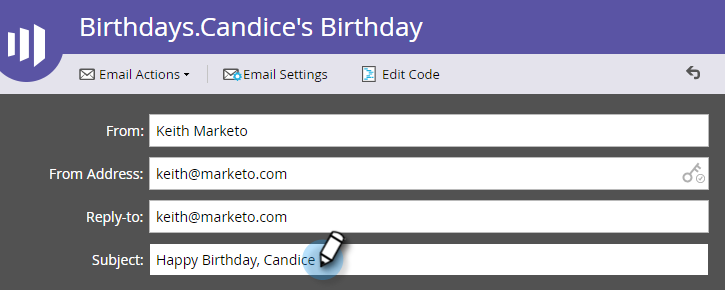

# 创建电子邮件 {#create-an-email}

在Marketo中创建电子邮件有两种主要方式。 我们来看看这两个。

## 在Design Studio中创建电子邮件 {#create-an-email-in-the-design-studio}

1. 转到 **Design Studio**.

   

1. 单击 **新** 下拉菜单并选择 **新建电子邮件**.

   

   >[!NOTE]
   >
   >在Design Studio中创建电子邮件时，可在树中的“电子邮件”下找到它。

简单！ 现在换个方式……

## 在营销活动中创建电子邮件 {#create-an-email-in-marketing-activities}

1. 转到 **营销活动**.

   

1. 选择要将电子邮件添加到的程序，单击 **新** 下拉菜单并选择 **新建本地资产**.

   

1. 单击 **电子邮件**.

   

   就是这样！

无论选择哪种方法，都会将您带到模板选取器。

1. 为您的电子邮件提供一个名称，单击要使用的模板，然后单击 **创建**.

   

   >[!NOTE]
   >
   >您可以从一组现成的响应式电子邮件模板中进行选择，也可以通过先选择而保存的模板 **我的模板**，并按照相同的步骤操作。

1. 输入主题行。 建议的字符限制为50。

   

   根据您选择的模板，您将拥有不同的选项来编辑电子邮件。 对于包含模块的电子邮件，请签出 [将模块添加到电子邮件](/help/marketo/product-docs/email-marketing/general/email-editor-2/add-modules-to-your-email.md).

您的电子邮件现已创建，请编辑掉！

>[!MORELIKETHIS]
>
>[编辑您的电子邮件标头](/help/marketo/product-docs/email-marketing/general/creating-an-email/edit-your-email-header.md)
