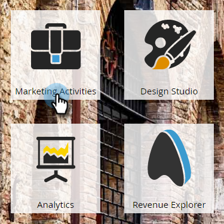

# 创建电子邮件{#create-an-email}

在Marketo中创建电子邮件的主要方法有两种。 让我们看看这两个。

## 在Design Studio中创建电子邮件{#create-an-email-in-the-design-studio}

1. 转到&#x200B;**Design Studio**。

   

1. 单击&#x200B;**新建**&#x200B;下拉框并选择&#x200B;**新建电子邮件**。

   

   >[!NOTE]
   >
   >在Design Studio中创建电子邮件时，可以在树中的“电子邮件”下找到该电子邮件。

简单！ 现在换个方式……

## 在营销活动中创建电子邮件{#create-an-email-in-marketing-activities}

1. 转到&#x200B;**营销活动**。

   

1. 选择要添加电子邮件的项目，单击&#x200B;**新建**&#x200B;下拉框，然后选择&#x200B;**新建本地资产**。

   

1. 单击&#x200B;**电子邮件**。

   

   就这样！

无论您选择哪种方法，您都可以转到模板选取器。

1. 为您的电子邮件命名，单击要使用的模板，然后单击&#x200B;**创建**。

   

   >[!NOTE]
   >
   >您可以选择随时可用的响应式电子邮件模板集合，或选择您保存的模板，方法是先选择&#x200B;**我的模板**，然后执行相同的步骤。

1. 输入主题行。 右边有一个计数器，告诉您是否在建议的50个字符的最大值下。

   

   根据您选择的模板，您将有不同的选项用于编辑电子邮件。 对于具有模块的电子邮件，请查看[将模块添加到您的电子邮件](/help/marketo/product-docs/email-marketing/general/email-editor-2/add-modules-to-your-email.md)。

您的电子邮件现已创建，请立即编辑！

>[!MORELIKETHIS]
>
>[编辑电子邮件标题](edit-your-email-header.md)
