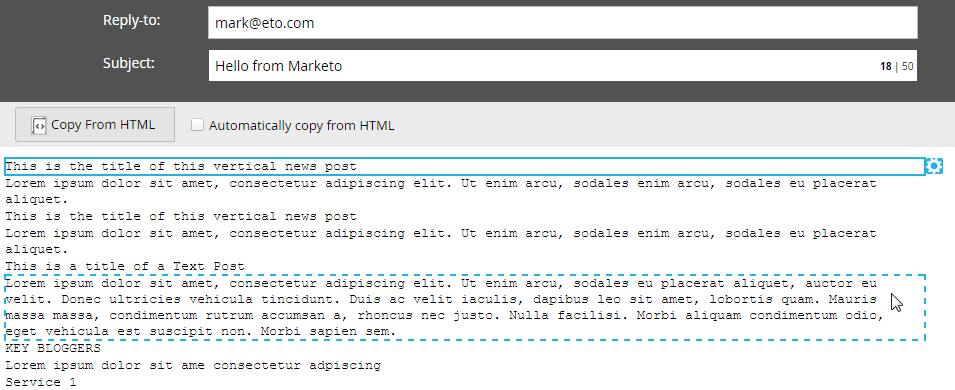

# 编辑电子邮件的文本版本{#edit-the-text-version-of-an-email}

创建电子邮件时，您可能希望其文本版本的措辞与HTML版本不同。 默认情况下，Marketo会将电子邮件中任何富文本元素的文本内容自动复制到文本版本。 下面介绍如何编辑它。

>[!NOTE]
>
>这不是有关创建纯文本电子邮件的文章。 有关此信息，请参阅[创建纯文本电子邮件](/help/marketo/product-docs/email-marketing/general/creating-an-email/create-a-text-only-email.md)。

1. 在电子邮件编辑器中，单击电子邮件底部的&#x200B;**文本**&#x200B;选项卡。

   

1. 取消选中&#x200B;**自动从HTML**&#x200B;复制以进行更改。

   

1. 多次-单击文本区域。

   

1. 进行编辑。 完成后，只需关闭编辑器或返回HTML版本。 更改将自动保存。

   

   如果您只有静态内容，文本将可以在一个大块中编辑（在步骤3中）。 如果您有动态内容，则文本将分为不同的可编辑部分，如下所示。

   

现在你知道了！
