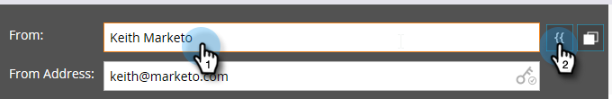
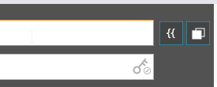

# 编辑您的电子邮件标头 {#edit-your-email-header}

Marketo中的电子邮件标头是完全可自定义的。 它包含四个字段：

* **起始日期**  — 您希望显示的发件人名称
* **发件人地址**  — 您希望显示的发件人电子邮件地址
* **回复**  — 您希望接收人员回复的电子邮件地址（可以不同于发件人地址）
* **主题**  — 电子邮件的主题行

要编辑这些值，请在每个字段中单击并输入您的信息。

>[!TIP]
>
>要设置默认发件人名称和发件人电子邮件，请参阅 [更改默认发件人电子邮件和发件人标签](/help/marketo/product-docs/administration/email-setup/change-the-default-from-email-and-from-label.md).

如果要使用令牌，请先在所需字段中单击，然后单击令牌图标。

您还可以使用区段使该字段成为动态字段。

“发件人地址”字段中最右侧的键图标可让您知道您是否使用自定义DKIM签名。

“主题”字段中最右侧的计数器可帮助您将主题行保持在建议的50个字符限制以下。

如果超过50个字符，计数器将变为红色以提醒您。

>[!MORELIKETHIS]
>
>[电子邮件编辑器v2.0概述](/help/marketo/product-docs/email-marketing/general/email-editor-2/email-editor-v2-0-overview.md)
