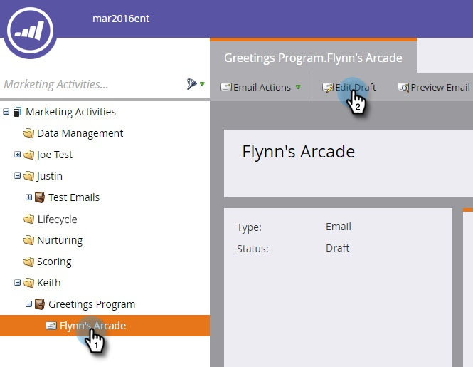
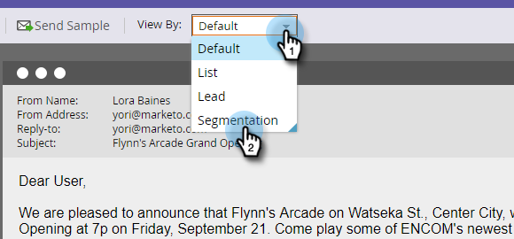

# 发送示例电子邮件{#send-a-sample-email}

发送电子邮件样本快速而简单。 要发送动态内容电子邮件，请参阅[用动态内容预览电子邮件](../../../../product-docs/email-marketing/general/functions-in-the-editor/preview-an-email-with-dynamic-content.md)。

>[!NOTE]
>
>您必须具有&#x200B;**访问数据库——运行单个流操作**&#x200B;权限才能发送示例电子邮件。

## 发送示例电子邮件{#send-a-sample-email-1}

1. 查找并选择您的电子邮件。 单击&#x200B;**电子邮件操作**&#x200B;下拉框并选择&#x200B;**发送示例**。\
   

   >[!NOTE]
   >
   >我的令牌解析为适合电子邮件项目的值。

1. 输入投放的电子邮件地址，然后单击&#x200B;**发送**。

   

   >[!NOTE]
   >
   >**提醒**
   >
   >
   >要输入多个电子邮件地址，请使用逗号分隔这些地址。

   >[!TIP]
   >
   >如果要将令牌解析为特定人员，请在步骤2的&#x200B;**person下拉框**&#x200B;中选择此人员。

## 在编辑{#send-a-sample-email-while-editing}时发送示例电子邮件

1. 找到您的电子邮件，选择它并单击&#x200B;**编辑草稿**&#x200B;选项卡。

   

1. 单击&#x200B;**电子邮件操作**，选择&#x200B;**发送示例**。

   

1. 输入投放的电子邮件地址，然后单击&#x200B;**发送**。

   

   >[!NOTE]
   >
   >触发字段仅适用于使用[电子邮件脚本](http://developers.marketo.com/documentation/velocity-script/)的用户。

## 根据区段{#send-a-sample-email-based-on-a-segment}发送示例电子邮件

>[!PREREQUISITES]
>
>[将分段应用于电子邮件](http://docs.marketo.com/display/public/DOCS/Using+Dynamic+Content+in+an+Email)。

1. 找到您的电子邮件，选择它并单击&#x200B;**编辑草稿**&#x200B;选项卡。

   

1. 单击&#x200B;**预览**。

   

1. 单击&#x200B;**视图By**&#x200B;下拉框并选择&#x200B;**分段**。

   

1. 此时会显示包含可用区段的下拉框。 单击它并选择所需的。

   

1. 使用箭头滚动浏览您的选项（在本例中，我们动态更改了主题行）。

   

1. 单击&#x200B;**发送示例**&#x200B;以接收您所在区段的测试电子邮件。

   

   >[!TIP]
   >
   >您还可以在电子邮件的编辑模式下根据区段发送示例电子邮件。 单击&#x200B;**电子邮件操作**&#x200B;下拉框，选择&#x200B;**发送示例**，然后选择您的区段。

在启动活动前对内容进行采样非常重要。 测量两次，剪一次！
