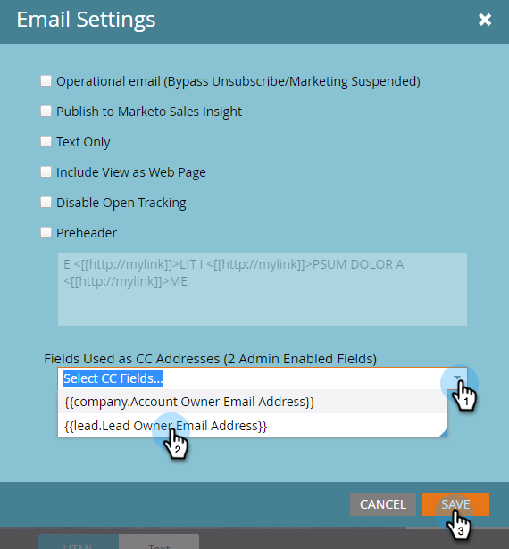

# 电子邮件抄送 {#email-cc}

电子邮件抄送允许通过Marketo发送的指定电子邮件包括抄送收件人。

此功能在所有Marketo电子邮件资源上都可用，无论电子邮件的发送方式如何（批量或触发营销活动）。 抄送收件人将收到发送给选定Marketo人员的电子邮件的精确副本。 因此，任何参与活动（打开、点击等） 将被记录到电子邮件的“收件人”行中Marketo人员的活动日志中。 但是，投放活动（已发送、已投放、硬退回等） _“软退回”除外_ 将 **非** 注册，因为Marketo无法将Marketo人员的投放事件与抄送收件人区分开来。 Marketo一次最多只能抄送10万人。 如果您的智能列表超过100，并且列表上的每个人都必须获得副本，我们建议将您的列表分类。

>[!NOTE]
>
>电子邮件抄送不适用于A/B测试。 如果您愿意，也可以使用，但是，由于技术上不支持，Marketo支持将无法协助进行任何故障排除。

## 设置电子邮件抄送 {#set-up-email-cc}

1. 在“我的Marketo”中，单击 **管理员**.

   

1. 在树中，选择 **电子邮件**.

   

1. 单击 **编辑电子邮件抄送设置**.

   

1. 选择最多25个Marketo潜在客户或公司字段（类型为“电子邮件”），以用作电子邮件中的抄送地址。 单击 **保存** 完成时。

   

## 使用电子邮件抄送 {#using-email-cc}

1. 选择您的电子邮件并单击 **编辑草稿**.

   

1. 单击 **电子邮件设置**.

   

1. 选择最多5个要用于抄送人员的字段。 在此示例中，我们只需要Lead Owner CC&#39;d。单击 **保存** 完成时。

   

   就这么简单！ 在上例中，当您发送电子邮件时，所选收件人的Lead Owner将被抄送。

   >[!NOTE]
   >
   >如果“抄送”字段中包含无效的电子邮件地址，则将跳过该字段。

   为了快速识别，“电子邮件摘要”视图显示是否/选择了哪些电子邮件抄送字段。

   

   如果电子邮件已获批准，但Marketo管理员在发送电子邮件之前禁用了一个或多个“抄送”字段， **那些人不会收到电子邮件**. 在该场景中，“电子邮件摘要”视图将灰显在审批后但在发送前禁用的任何字段：

   

   >[!NOTE]
   >
   >您还将在电子邮件草稿的电子邮件设置部分中看到上述错误。

## 发送后 {#after-the-send}

* 如果抄送收件人单击电子邮件中的跟踪链接，则点击活动（与所有其他参与活动一样）将与电子邮件的主收件人关联。 此外，他们可以单击进入包含Marketo Web跟踪代码(munchkin.js)的页面，从而导致他们被作为主收件人进行编码。

>[!TIP]
>
>您可以选择以下选项 [禁用部分或全部跟踪链接](/help/marketo/product-docs/email-marketing/general/functions-in-the-editor/disable-tracking-for-an-email-link.md) 一封电子邮件中。

* 执行电子邮件营销活动后，“发送电子邮件”活动将包括邮件每个收件人所包含的所有CC地址的列表。 如果由于取消订阅而跳过了任何CC地址，则活动中也会注明该地址。
* 取消订阅链接和页面在抄送电子邮件中正常工作。 这样一来，抄送收件人就可以根据自己的意愿成功取消订阅（遵守反垃圾邮件法规），而且此操作的记录将存储在Marketo数据库中。
* 在Marketo数据库中被列为已取消订阅的用户将 **非** 通过抄送接收电子邮件。
