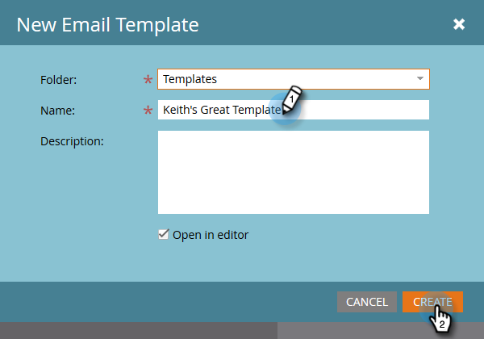

# 创建电子邮件模板 {#create-an-email-template}

按照以下步骤创建新电子邮件模板。

>[!NOTE]
>
>Marketo支持未设置为协助对自定义HTML进行故障诊断。 如需HTML帮助，请咨询Web开发人员。

>[!CAUTION]
>
>我们使用的编辑器将颜色和背景颜色CSS属性的值转换为小写，因此请避免使用驼峰式大写，改为使用小写名称或连字符。

## 创建新电子邮件模板 {#create-a-new-email-template}

1. 单击 **Design Studio**.

   

1. 单击 **新建**，然后选择 **新电子邮件模板**.

   

1. 为新模板指定一个名称并单击 **创建**.

   

1. 要开始编辑新模板，请单击 **编辑草稿**.

   

   >[!CAUTION]
   >
   >虽然没有硬限制，但一旦超过500封电子邮件使用了电子邮件模板，则在更新后重新批准该模板可能会导致性能问题。 我们建议一个电子邮件模板关联500封电子邮件后，再创建新模板。

## 将电子邮件另存为模板 {#save-an-email-as-a-template}

如果您创建了要另存为模板以供将来使用的电子邮件，请执行以下简单步骤。

1. 单击 **营销活动**.

   

1. 查找并选择您的电子邮件，然后单击 **编辑草稿**.

   

1. 单击 **电子邮件操作** 下拉框并选择 **另存为模板**.

   

1. 单击 **文件夹** 下拉列表中，选择您希望模板的存放位置，然后单击 **保存**.

   

   就这样！

   >[!CAUTION]
   >
   >将电子邮件另存为模板时，变量值将不会结转。 变量将继续使用基础模板中指定的默认值。 除非已将电子邮件正文中的可用模块插入，否则电子邮件中的可用模块也将不会结转。

要自定义电子邮件模板，请参阅以下文章。

>[!MORELIKETHIS]
>
>[电子邮件模板语法](/help/marketo/product-docs/email-marketing/general/email-editor-2/email-template-syntax.md)
