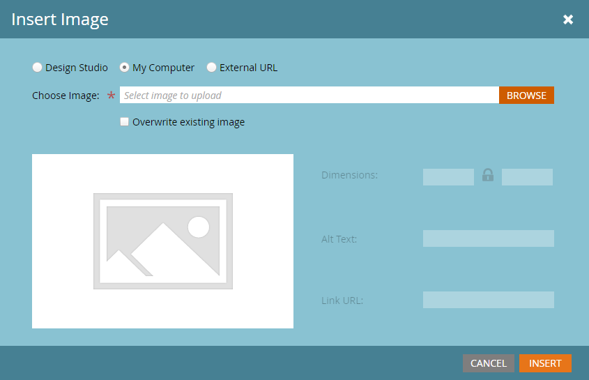
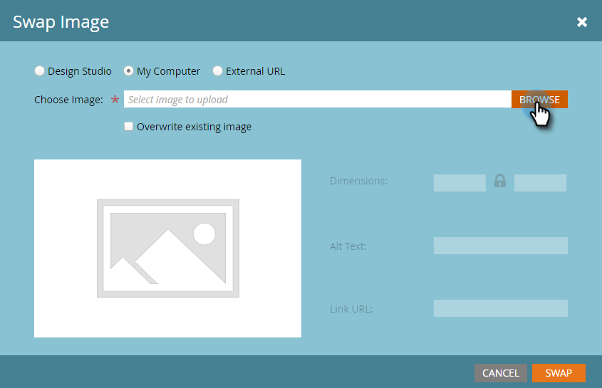

# 编辑电子邮件中的元素 {#edit-elements-in-an-email}

电子邮件可以包含四个不同的元素：富文本、图像、代码片段和视频。 下面是如何编辑每个页面的。

## 如何编辑富文本元素 {#how-to-edit-the-rich-text-element}

1. 查找您的电子邮件，选择它并单击 **编辑草稿**.

   

1. 此时将打开电子邮件编辑器。 选择富文本，单击齿轮图标并选择 **编辑**.

   

   您还可以将鼠标悬停在右侧窗格中的元素上，从而导致出现齿轮图标。

   

1. 添加/编辑文本并按 **保存**.

   

   >[!NOTE]
   >
   >您还可以添加图像、令牌、表和其他元素。 请参阅 [使用富文本编辑器](/help/marketo/product-docs/email-marketing/general/understanding-the-email-editor/using-the-rich-text-editor.md).

   >[!CAUTION]
   >
   >避免从富文本源（如网站或Word文档）复制和粘贴文本。 相反，请首先将富文本粘贴到纯文本编辑器中，例如记事本(Windows)或TextEdit (Mac)。 一旦它变为“干净”，您就可以将其从纯文本编辑器复制并粘贴到电子邮件中。

## 如何编辑图像元素 {#how-to-edit-the-image-element}

1. 使用图像元素单击模块内部以将其选定。

   

1. 单击要编辑的图像元素，然后单击齿轮图标并选择 **编辑**.

   

   >[!NOTE]
   >
   >您还可以双击元素以开始编辑。

1. 此时将显示图像编辑器。

   

   有三种插入图像的选项。 让我们分别看一看。

   **外部URL**

   >[!NOTE]
   >
   >如果要使用Marketo令牌，请使用此选项。 请记住，使用令牌时，图像在编辑器中将显示为损坏，但将在预览模式和发送示例电子邮件中呈现。

   要使用外部URL，请首先粘贴图像的URL。 根据您的需求更改维度，并添加一些替换文本（可选）。 然后按下 **交换**.

   

   **我的电脑**

   要从计算机上传图像，请单击 **浏览**.

   

   导航到图像在计算机上的位置并将其插入。

   

   根据需要更改尺寸，更改Alt文本（可选），然后按 **交换**.

   

   >[!NOTE]
   >
   >如果要替换图像，您需要检查 **覆盖现有图像** 方框。

   **Design Studio**

   若要从设计工作室插入图像，只需找到它……

   

   ...并插入它。 根据需要更改尺寸，更改Alt文本（可选），然后按 **交换**.

   

## 如何编辑代码片段元素 {#how-to-edit-the-snippet-element}

1. 单击模块内部的Snippet元素。

   

1. 单击代码片段元素，然后单击齿轮图标并选择 **编辑**.

   

1. 找到您的代码片段，将其选中，然后单击 **保存**.

   

1. 随后将填充您的代码片段。

   

## 如何编辑视频元素 {#how-to-edit-the-video-element}

1. 使用Video元素单击模块内部。

   

1. 单击视频元素，然后单击齿轮图标并选择 **编辑**.

   

1. 将Vimeo或YouTube中的视频URL粘贴。 然后，单击退出URL框以加载预览。 根据需要更改尺寸，添加替换文本（可选），然后按 **插入**.

   

   >[!NOTE]
   >
   >对于YouTube视频，请使用地址栏中的完整URL，而不是使用在共享选项中找到的快捷方式URL。

祝您设计完美的电子邮件愉快！
