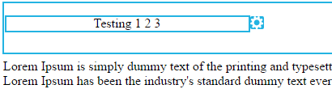

# 编辑电子邮件{#edit-elements-in-an-email}中的元素

电子邮件可包含四个不同元素：富文本、图像、片段和视频。 下面介绍如何编辑每个组件。

## 如何编辑富文本元素{#how-to-edit-the-rich-text-element}

1. 找到您的电子邮件，选择它并单击&#x200B;**编辑草稿**。

   

1. 将打开电子邮件编辑器。 选择富文本，单击齿轮图标，然后选择&#x200B;**编辑**。

   

   您还可以将鼠标悬停在右侧窗格中的元素上，从而显示齿轮图标。

   

1. 添加／编辑文本并按&#x200B;**保存**。

   

   >[!NOTE]
   >
   >您还可以添加图像、令牌、表格和其他元素。 请参阅[使用富文本编辑器](/help/marketo/product-docs/email-marketing/general/understanding-the-email-editor/using-the-rich-text-editor.md)。

   >[!CAUTION]
   >
   >避免从富文本源(如网站或Word文档)复制和粘贴文本。 而是先将富文本粘贴到纯文本编辑器中，如记事本(Windows)或TextEdit(Mac)。 一旦“干净”，您就可以从纯文本编辑器复制它并粘贴到电子邮件中。

## 如何编辑图像元素{#how-to-edit-the-image-element}

1. 在包含图像元素的模块中单击以选择它。

   

1. 单击要编辑的图像元素，然后单击齿轮图标并选择&#x200B;**编辑**。

   

   >[!NOTE]
   >
   >您还可以多次单击元素开始编辑。

1. 此时将显示图像编辑器。

   

   有三种插入图像的方法。 让我们看看每一个。

   **外部URL**

   >[!NOTE]
   >
   >如果要使用Marketo令牌，请使用此选项。 请记住，当您使用令牌时，图像在编辑器中将显示为损坏，但在预览模式和发送示例电子邮件中呈现。

   要使用外部URL，请先粘贴到图像的URL中。 根据需要更改尺寸，并添加一些替代文本（可选）。 然后按&#x200B;**Swap**。

   

   **我的电脑**

   要从计算机上传图像，请单击&#x200B;**浏览**。

   

   导航到图像在计算机上的位置并插入它。

   

   根据需要更改尺寸，更改替代文本（可选），然后按&#x200B;**Swap**。

   

   >[!NOTE]
   >
   >如果要替换图像，则需要选中图像URL/名称下方显示的&#x200B;**覆盖现有图像**&#x200B;框。

   **Design Studio**

   要从Design Studio插入图像，只需找到它……

   

   ...并插入。 根据需要更改尺寸，更改替代文本（可选），然后按&#x200B;**Swap**。

   

## 如何编辑代码片断元素{#how-to-edit-the-snippet-element}

1. 在模块内单击“代码片断”元素。

   

1. 单击“代码片断”元素，然后单击齿轮图标并选择&#x200B;**编辑**。

   

1. 找到您的代码片断，选择它，然后单击&#x200B;**保存**。

   

1. 随后将填充您的片段。

   

## 如何编辑视频元素{#how-to-edit-the-video-element}

1. 在包含“视频”元素的模块内单击。

   

1. 单击“视频”元素，然后单击齿轮图标，然后选择“编辑”**。**

   

1. 从Vimeo或YouTube粘贴到视频URL中。 然后，在要加载的预览的URL框中单击。 根据需要更改尺寸，添加替代文本（可选），然后按&#x200B;**插入**。

   

   >[!NOTE]
   >
   >对于YouTube视频，请使用地址栏中的完整URL，而不是“共享”选项中的快捷URL。

设计完美电子邮件的乐趣！
