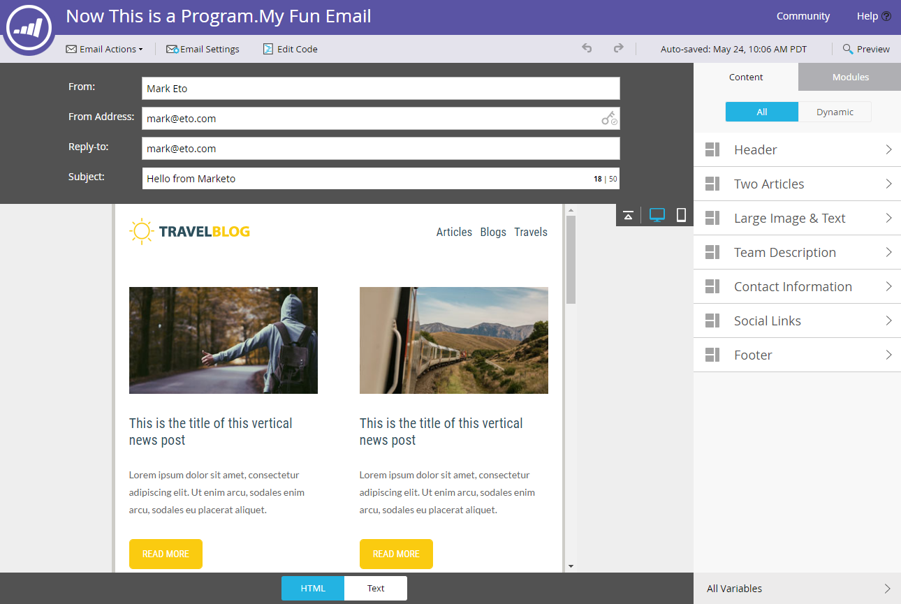

# 电子邮件编辑器v2.0概述 {#email-editor-v-overview}

当您决定激活Email Editor v2.0时，您会注意到几项新功能。

**电子邮件模板选取器**

创建新电子邮件时，您会转到 [电子邮件模板选取器](/help/marketo/product-docs/email-marketing/general/email-editor-2/email-template-picker-overview.md).

**电子邮件编辑器**

当您开始编辑电子邮件时，您会注意到编辑器的外观全新。

**模块**

编辑器右侧的这些内容称为模块。 了解如何 [向电子邮件添加模块](/help/marketo/product-docs/email-marketing/general/email-editor-2/add-modules-to-your-email.md).

**文本版本**

现在，在电子邮件的HTML版本和文本版本之间切换时，可在底部的方便选项卡中进行。 了解如何 [编辑电子邮件的文本版本](/help/marketo/product-docs/email-marketing/general/creating-an-email/edit-the-text-version-of-an-email.md).

**电子邮件标头**

需要更多设计空间吗？ 完成后，可以隐藏电子邮件标头 [编辑它](/help/marketo/product-docs/email-marketing/general/creating-an-email/edit-your-email-header.md). 只需单击此图标……

...且标头将折叠。

**预览电子邮件**

默认情况下，电子邮件会显示它在桌面上的外观，如突出显示的蓝色图标所示。 如果单击其右侧的图标……

...您将会看到电子邮件在移动设备上呈现的方式。

要获得更大的预览，请单击 **预览** 在电子邮件的右上角。

默认视图为桌面……

...但是您还可以看到它在移动设备上的外观。 您还可以预览文本版本！ 只需单击 **编辑草稿** 以继续编辑。

**电子邮件操作**

下 **电子邮件操作**，您会注意到一些新增功能。 **上传图像或文件**、和 **从Web获取图像**. 您还可以将电子邮件本身另存为新电子邮件模板。 你只需要给它一个名字和一个目的地。

>[!CAUTION]
>
>将电子邮件另存为模板时，变量值不会延续。 变量将继续使用基础模板中指定的默认值。 除非将电子邮件中的可用模块插入电子邮件正文中，否则它们也不会延续。

>[!NOTE]
>
>**[从Web获取图像](/help/marketo/product-docs/demand-generation/images-and-files/grab-the-images-from-a-web-page.md)** 就像在Design Studio中一样。

**禁用打开跟踪** 下 **电子邮件设置**&#x200B;中，您可以根据需要禁用打开跟踪。

**电子邮件设置**

您可以选择添加预编译标头。 “预编译标题”是在收件箱中查看电子邮件时主题行后面的简短摘要文本。

>[!CAUTION]
>
>使用电子邮件编辑器时，令牌在预览版中不起作用。 要在预标头中使用令牌，它必须通过您在电子邮件模板中自己的HTML。

许多出色的新功能！ 玩得开心点！

>[!NOTE]
>
>如果您想更深入地进行研究，请查看此 [有用的视频](https://nation.marketo.com/videos/1463).

>[!MORELIKETHIS]
>
>[电子邮件模板语法](/help/marketo/product-docs/email-marketing/general/email-editor-2/email-template-syntax.md)
