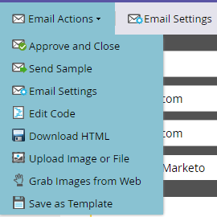

# 电子邮件编辑器 v2.0 概述 {#email-editor-v2-overview}

经典电子邮件编辑器概述。

>[!IMPORTANT]
>
>虽然尚未确定具体日期，但经典电子邮件编辑器很可能会在 2026 年的某个时间弃用（届时将公布确切日期）。强烈建议开始采用高级[电子邮件设计器](/help/marketo/product-docs/email-marketing/email-designer/overview.md){target="_blank"}，因为它具备经典编辑器所不具备的多项功能。

**电子邮件模板选择器**

当您创建新的电子邮件时，系统会引导您进入[电子邮件模板选择器](/help/marketo/product-docs/email-marketing/general/email-editor-2/email-template-picker-overview.md)。

**电子邮件编辑器**

开始编辑电子邮件时，您会注意到编辑器采用了全新的界面设计。

**模块**

编辑器右侧显示的这些内容称为模块。了解如何[将模块添加到电子邮件中](/help/marketo/product-docs/email-marketing/general/email-editor-2/add-modules-to-your-email.md)。

**文本版本**

现在，您可以通过底部的便捷选项卡在电子邮件的 HTML 版本和文本版本之间进行切换。了解如何[编辑电子邮件的文本版本](/help/marketo/product-docs/email-marketing/general/creating-an-email/edit-the-text-version-of-an-email.md)。

**电子邮件页眉**

想要更多设计空间吗？[完成编辑后](/help/marketo/product-docs/email-marketing/general/creating-an-email/edit-your-email-header.md)，可以隐藏电子邮件页眉。只需点击该图标…

…页眉即可折叠隐藏。

**预览电子邮件**

默认情况下，电子邮件会以桌面端显示效果进行展示，如高亮显示的蓝色图标所示。如果点击其右侧的图标…

…即可查看电子邮件在移动设备上的呈现效果。

如需更大尺寸的预览，请点击电子邮件右上角的 **[!UICONTROL Preview]**。

该预览界面默认显示桌面端效果…

…同时也可以切换查看移动端效果。您还可以预览文本版本！只需点击右上角的 **[!UICONTROL Edit Draft]** 即可继续编辑。

**[!UICONTROL Email Actions]**

在 **[!UICONTROL Email Actions]** 下，您会注意到一些新功能。**[!UICONTROL Upload an Image or File]** 和 **[!UICONTROL Grab Images from Web]**。您还可以将当前电子邮件保存为新的电子邮件模板。只需为其指定名称和保存位置即可。

>[!CAUTION]
>
>将电子邮件保存为模板时，变量值不会一并保留。变量将继续使用底层模板中指定的默认值。除非模块已插入到电子邮件正文中，否则可用模块也不会随模板一并保留。

>[!NOTE]
>
>**[[!UICONTROL Grab Images from Web]](/help/marketo/product-docs/demand-generation/images-and-files/grab-the-images-from-a-web-page.md)** 的工作方式与 [!UICONTROL Design Studio] 中相同。

**[!UICONTROL Disable Open Tracking]** 在 **[!UICONTROL Edit Settings]** 下，您可以根据需要禁用打开追踪。

**[!UICONTROL Edit Settings]**

您可以选择添加 [!UICONTROL Preheader]。[!UICONTROL Preheader] 是在收件箱中查看电子邮件时，显示在主题行后的一小段摘要文本。

>[!CAUTION]
>
>在使用电子邮件编辑器时，令牌无法在 [!UICONTROL Preheader] 中生效。如需在 [!UICONTROL Preheader] 中使用令牌，必须通过电子邮件模板中的自定义 HTML 来实现。

还有许多出色的新功能！尽情体验吧！

>[!NOTE]
>
>如果您想进一步深入了解，请查看此[视频](https://nation.marketo.com/videos/1463)。

>[!MORELIKETHIS]
>
>[电子邮件模板语法](/help/marketo/product-docs/email-marketing/general/email-editor-2/email-template-syntax.md)
