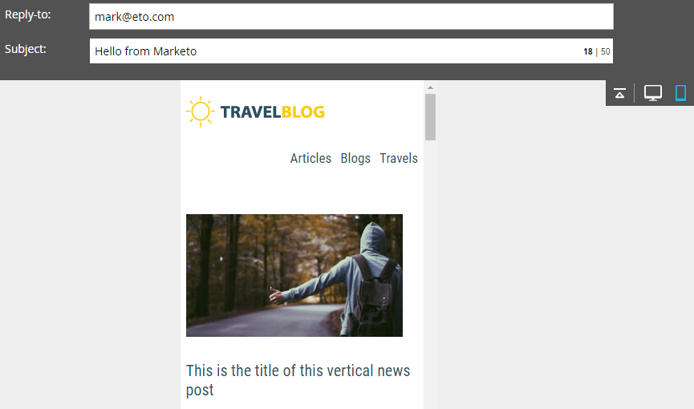

# 电子邮件编辑器 v2.0 概述 {#email-editor-v2-overview}

当您决定激活[!DNL Email Editor v2.0]时，您会注意到几项新功能。

**电子邮件模板选取器**

创建新电子邮件时，您会进入[电子邮件模板选取器](/help/marketo/product-docs/email-marketing/general/email-editor-2/email-template-picker-overview.md)。

**电子邮件编辑器**

当您开始编辑电子邮件时，您会注意到编辑器的外观有了全新的外观。

**个模块**

编辑器右侧的这些内容称为模块。 了解如何[将模块添加到电子邮件](/help/marketo/product-docs/email-marketing/general/email-editor-2/add-modules-to-your-email.md)。

**文本版本**

现在，在电子邮件的HTML版本和文本版本之间切换时，位于底部的方便选项卡中。 了解如何[编辑电子邮件的文本版本](/help/marketo/product-docs/email-marketing/general/creating-an-email/edit-the-text-version-of-an-email.md)。

**电子邮件标头**

需要更多设计空间吗？ 电子邮件标头在您完成[编辑后](/help/marketo/product-docs/email-marketing/general/creating-an-email/edit-your-email-header.md)可以隐藏。 只需单击此图标……

...标题将折叠。

**预览电子邮件**

默认情况下，电子邮件会显示它在桌面上的外观，如突出显示的蓝色图标所示。 如果单击其右侧的图标……

...您将会看到电子邮件在移动设备上呈现的方式。

要获得更大的预览，请单击电子邮件右上角的&#x200B;**[!UICONTROL Preview]**。

默认视图为桌面……

...但是您还可以看到它在移动设备上的外观。 您还可以预览文本版本！ 只需单击右上角的&#x200B;**[!UICONTROL Edit Draft]**&#x200B;即可继续编辑。

**[!UICONTROL Email Actions]**

在&#x200B;**[!UICONTROL Email Actions]**&#x200B;下，您会注意到一些新功能。 **[!UICONTROL Upload an Image or File]**&#x200B;和&#x200B;**[!UICONTROL Grab Images from Web]**。 您还可以将电子邮件本身另存为新电子邮件模板。 你只要给它一个名字和一个目的地。

>[!CAUTION]
>
>将电子邮件另存为模板时，变量值不会延续。 变量将继续使用基础模板中指定的默认值。 除非将电子邮件中的可用模块插入电子邮件正文中，否则它们也不会延续。

>[!NOTE]
>
>**[[!UICONTROL Grab Images from Web]](/help/marketo/product-docs/demand-generation/images-and-files/grab-the-images-from-a-web-page.md)**&#x200B;的工作方式与它在[!UICONTROL Design Studio]中的工作方式相同。

**[!UICONTROL Disable Open Tracking]**&#x200B;在&#x200B;**[!UICONTROL Edit Settings]**&#x200B;下，您可以根据需要禁用打开跟踪。

**[!UICONTROL Edit Settings]**

您可以选择添加[!UICONTROL Preheader]。 在收件箱中查看电子邮件时，[!UICONTROL Preheader]是主题行之后的简短摘要文本。

>[!CAUTION]
>
>使用电子邮件编辑器时，令牌在[!UICONTROL Preheader]中不起作用。 要在[!UICONTROL Preheader]中使用令牌，必须通过在电子邮件模板中通过您自己的HTML来使用。

许多出色的新功能！ 玩得开心！

>[!NOTE]
>
>如果您想更深入地进行研究，请查看此[视频](https://nation.marketo.com/videos/1463)。

>[!MORELIKETHIS]
>
>[电子邮件模板语法](/help/marketo/product-docs/email-marketing/general/email-editor-2/email-template-syntax.md)
