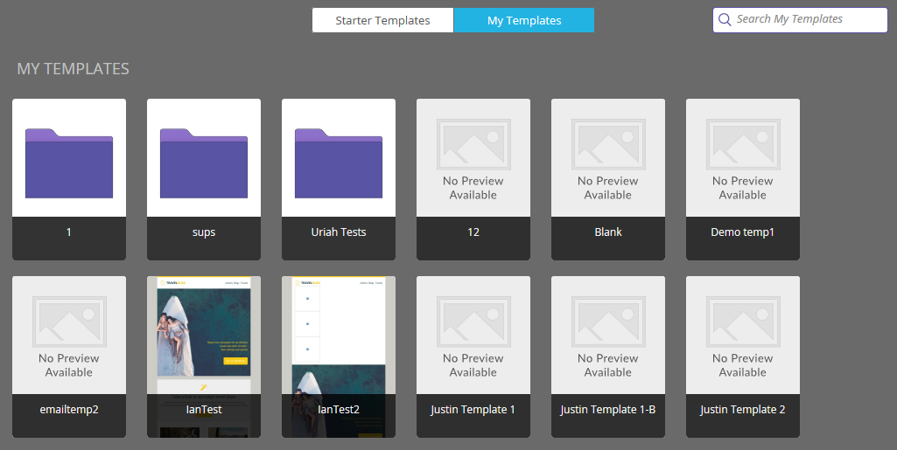

# 电子邮件模板选取器概述{#email-template-picker-overview}

在[创建电子邮件](/help/marketo/product-docs/email-marketing/general/creating-an-email/create-an-email.md)时，您有几个可供选择的免费模板。 您还可以创建自己的模板并保存以供将来使用。

**“名** 称”将是您根据模板创建的电子邮件的名称，而不是模板本身。**说** 明也适用于电子邮件，是可选的。

如果您的电子邮件是关键邮件并且您希望其避开通信限制，请选中该复选框，使其能够正常运行。 **默认情** 况下，在编辑器中打开处于选中状态，这只意味着您希望立即开始编辑新电子邮件。**创** 建，创建！

**入门** 模板包含一组随时可用的响应式电子邮件模板。您可以按原样使用它们，也可以根据自己的喜好自定义它们。

>[!NOTE]
>
>Marketo的入门模板免费提供给所有客户。 虽然它们将不断更新并针对主要电子邮件客户端（和移动设备）进行优化，但您应始终评估它们是否满足您的需求。 Marketo的[电子邮件发送工具](/help/marketo/product-docs/email-marketing/deliverability/email-deliverability-tool.md)可显示不同电子邮件客户端上模板的呈现。 不幸的是，Marketo在付费服务约定之外无法接受设计请求。

**我** 的模板包含您创建的所有模板。您可能还有文件夹。

Design Studio树中“电子邮件”>“模板”下显示的所有文件夹都将在&#x200B;**“我的模板”**&#x200B;中可用。

要预览模板，请将指针悬停在模板的缩略图上，然后单击&#x200B;**预览**。 您也只需多次单击它。

预览器会向您显示模板在桌面计算机上的呈现方式……

...和移动设备。

如果您喜欢此模板，请单击右下方的&#x200B;**选择**&#x200B;进行选择。 想继续找吗？ 单击右上角的&#x200B;**X**。 使用向左和向右箭头滚动浏览模板。

您还可以右键单击模板缩略图以获取更多选项。

>[!NOTE]
>
>模板缩览图最酷之处在于，它们是实时的。 因此，如果您对模板进行了更改，缩略图也会随之更改。

很整齐！

>[!MORELIKETHIS]
>
>* [电子邮件模板语法](/help/marketo/product-docs/email-marketing/general/email-editor-2/email-template-syntax.md)
>* [创建电子邮件](/help/marketo/product-docs/email-marketing/general/creating-an-email/create-an-email.md)

