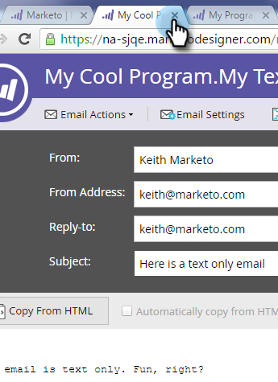

# 向文本电子邮件添加跟踪链接 {#add-tracked-links-to-a-text-email}

>[!PREREQUISITES]
>
>* [创建纯文本电子邮件](/help/marketo/product-docs/email-marketing/general/creating-an-email/create-a-text-only-email.md)
>* [编辑电子邮件中的元素](/help/marketo/product-docs/email-marketing/general/email-editor-2/edit-elements-in-an-email.md)

可在Marketo中跟踪文本电子邮件链接。 让我们看看它是如何运作的。

1. 选择您的电子邮件并单击&#x200B;**编辑草稿**。

1. 选择您的电子邮件并单击&#x200B;**[!UICONTROL Edit Draft]**。

   

1. 双击要向其添加链接的可编辑区域。

   

1. 输入带有双括号的URL，如下所示： `[[www.domain.com/path/page.html]]`。

   

   >[!CAUTION]
   >
   >如果在365天前&#x200B;**和**&#x200B;发送了一封电子邮件，且过去180天内没有人点击过该电子邮件的任何链接，则Marketo Engage会从我们的数据库中修剪指向URL的路由，从而导致链接断开。 如果您需要永久性链接，请勿使用跟踪。

1. 关闭编辑器，别忘了批准草稿。

   

>[!NOTE]
>
>mktNoTok类功能不适用于文本电子邮件中的可跟踪链接。 仅适用于HTML电子邮件。
