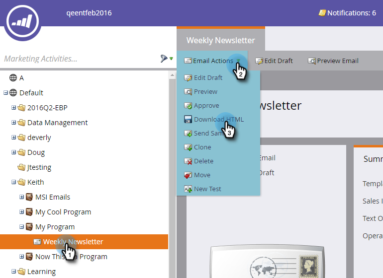

# 下载电子邮件的 HTML {#download-an-emails-html}

出于备份和其他目的，您可以使用Marketo下载电子邮件的HTML内容。

1. 找到电子邮件并将其选定。 在&#x200B;**[!UICONTROL Email Actions]**&#x200B;下拉列表中，单击&#x200B;**[!UICONTROL Download HTML]**。

   

就是这么简单！
