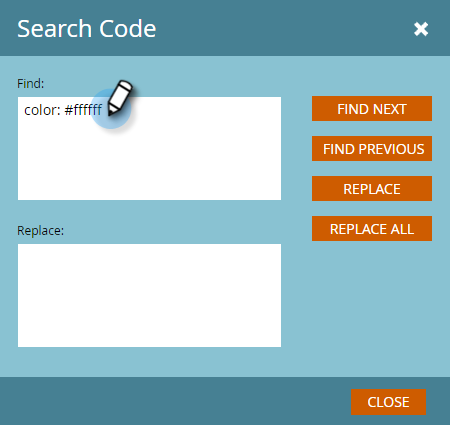

# 编辑电子邮件的HTML {#edit-an-emails-html}

有时您可能需要修改电子邮件的基础HTML。 有时，您可能会使用外部系统来设计和构建电子邮件代码。 无论采用哪种方式，您都可以在电子邮件编辑器中轻松导入和／或编辑代码。

## 编辑HTML {#edit-html}

1. 选择您的电子邮件，然后单 **击“编辑草稿**”。

   

1. 单击 **编辑代码**。

   

1. 进行任何更改。 完成后 **单击** “保存”。

   

   >[!NOTE]
   >
   >随你改变。 您可以替换整个HTML或进行细微调整。

1. 单击 **“代码操作** ”下拉框，以。html文件形式下载代码、嵌入CSS或验证HTML。

   

   >[!NOTE]
   >
   >电子邮件的最佳实践是让所有样式都内嵌在内。 该部分中有几个电子邮件客户端不支持 `<head>` CSS。

## 从模板中断电子邮件 {#breaking-an-email-from-its-template}

这些代码更 **改不会** 从其模板中断电子邮件：

* 编辑任何模块的内容（包括在模块中添加新元素）
* 向容器添加新模块
* 从容器中删除模块

* 更改模块外任何元素的mkto特定属性（例如“mktoName”或“mktoImgUrl”）
* 编辑任何元素的内容（富文本、图像、视频等） 模块外部

在代码编辑器中可以执行的下列操 **作** ，会从电子邮件的模板中断出来：

* 更改元素或模块外的代码中的任何内容
* 添加或更改模块外任何元素的非mkto属性（例如“id”或“style”）
* 删除模块外的元素

## 搜索代码 {#search-code}

使用搜索代码功能高效查找和替换电子邮件HTML代码中的内容。

1. 在电子邮件代码中，单击“搜 **索代码”**。

   

1. 输入要查找的内容，然后单击“查 **找下一** 步”向前搜索，或 **单击“查找上一** 步”向后搜索。 您还可以选择“替换” **和** “ **全部替换”**。

   

1. 完成后 **单击** “关闭”。

   

   >[!NOTE]
   >
   >搜索代码也可在电子邮件模 [板编辑器中使用](http://docs.marketo.com/display/DOCS/Create+a+New+Email+Template)。

我们建议您继续使用Marketo的内置功能编辑您的电子邮件，但此代码编辑器确实提供了灵活性（如果需要）。
