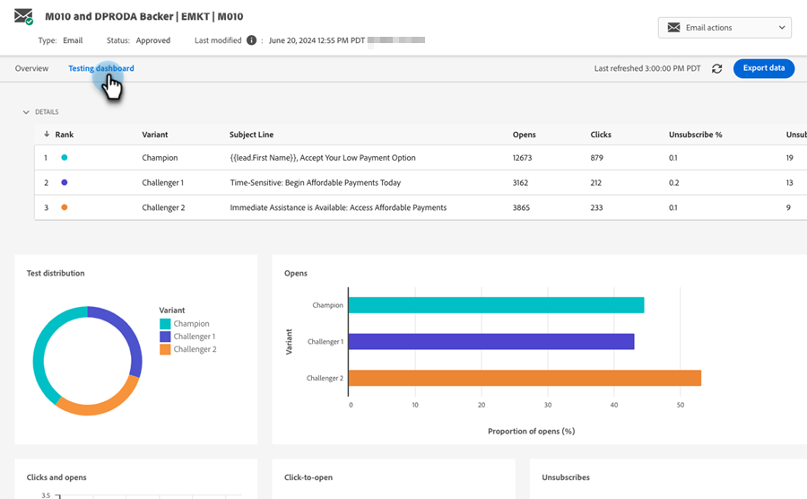

# 冠军/挑战者：Analytics {#champion-challenger-analytics}

接收报告警报和/或查看冠军/挑战者信息板，以获取有用的分析。

>[!PREREQUISITES]
>
>[冠军/挑战者：定义冠军标准](/help/marketo/product-docs/email-marketing/general/functions-in-the-editor/email-tests-champion-challenger/champion-challenger-define-champion-criteria.md)

## 配置报表警报 {#configure-report-alerts}

Marketo将向您发送有关电子邮件测试进展的报告。 下面是如何安排它的。

1. 让我们将报告安排在星期五上午9点每周发送一次。

   

   >[!TIP]
   >
   >如果您愿意，可以选择一周中的多天。 单击以选择，再次单击以取消选择。

1. 输入要将报告发送到的电子邮件地址。

   

1. 单击&#x200B;**下一步**。

   

1. 验证所有信息是否正确，然后单击&#x200B;**关闭**。

   

   该报告将包含详细信息，例如：测试类型、入选者条件、电子邮件打开次数等。 此外，还会有指向测试本身的直接链接，允许您声明入选者！ 很酷的东西。

## 冠军/挑战者信息板 {#champion-challenger-dashboard}

Champion/Challenger仪表板提供有关您的Champion/Challenger试验中控件和变体的性能的详细分析（打开、单击次数、取消订阅百分比以及在配置电子邮件测试期间使用的其他变量）。 仪表板还提供了各种电子邮件变体的目标受众的分布详细信息，以及所有变体的打开次数、点击次数、点击打开率和取消订阅量的聚合比例。

