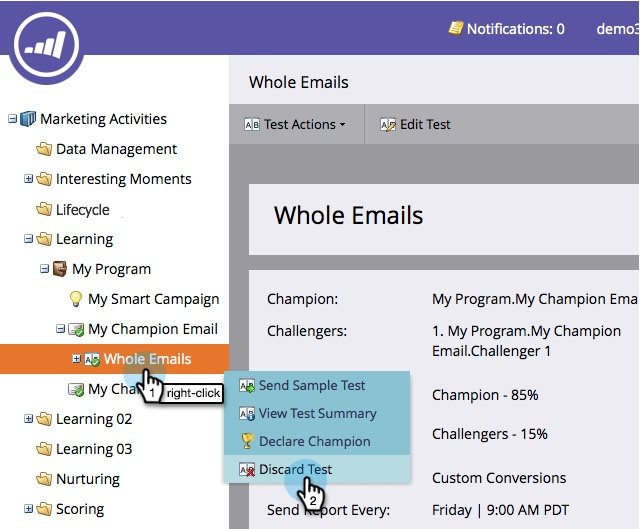
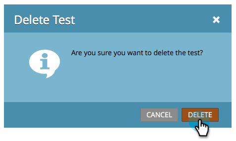

# 挑战者对比：放弃电子邮件测试 {#champion-challenger-discard-an-email-test}

如果在任何时候决定不要继续运行电子邮件测试，则可以将其放弃。 操作方法如下：

>[!PREREQUISITES]
>
>[冠军/挑战者：批准您的电子邮件测试](/help/marketo/product-docs/email-marketing/general/functions-in-the-editor/email-tests-champion-challenger/champion-challenger-approve-your-email-test.md)

1. 前往 **[!UICONTROL Marketing Activities]**。

   

1. 查找并右键单击您的电子邮件测试，然后单击&#x200B;**[!UICONTROL Discard Test]**。

   

1. 单击 **[!UICONTROL Delete]** 确认。

   

   你完了！ 如果您决定要再次设置测试，请继续[添加电子邮件冠军/挑战者](/help/marketo/product-docs/email-marketing/general/functions-in-the-editor/email-tests-champion-challenger/add-an-email-champion-challenger.md)。
