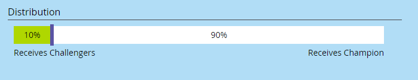

# 冠军/挑战者：主题行 {#champion-challenger-subject-line}

您可以轻松测试多个主题行。 测试结束后，发送包含最有效测试的电子邮件。 下面是操作方法。

>[!PREREQUISITES]
>
>[添加电子邮件冠军/挑战者](/help/marketo/product-docs/email-marketing/general/functions-in-the-editor/email-tests-champion-challenger/add-an-email-champion-challenger.md)

1. 在电子邮件测试编辑器中，选择 **主题行** 在 **测试类型** 下拉菜单。

   

   >[!NOTE]
   >
   >在主题测试中，输入的第一个主题行被指定为 **冠军**. 后续主题行将被调用 **挑战者**.

1. 输入主题行 **挑战者**.

   

   >[!TIP]
   >
   >如果您需要多个挑战者，请单击加号并输入其他主题行。

1. 拖动滑块以确定获得冠军主题行的人与挑战者主题行之间的百分比拆分。

   

   >[!NOTE]
   >
   >**示例**
   >
   >在上面显示的分布中，智能列表中指定的总受众的10%会收到一封包含挑战者主题行的电子邮件，90%会收到包含冠军主题行的电子邮件。 包含多个挑战者主题行的电子邮件平均占有10%。 测试结束后，您可以手动声明入选者。 从那时起，所有未来的人都会获得性能更好的内容。

   为了获得统计置信度，请确保选择的百分比包含足够的人员，以便您的测试有效。 不要被无定论的结果所愚弄。 [比以往任何时候都要多的关于统计置信度的信息](https://en.wikipedia.org/wiki/Confidence_interval).

1. 单击 **下一个**.

   

   进度! 让我们继续下去。

   >[!MORELIKETHIS]
   >
   >[冠军/挑战者：定义冠军标准](/help/marketo/product-docs/email-marketing/general/functions-in-the-editor/email-tests-champion-challenger/champion-challenger-define-champion-criteria.md)
