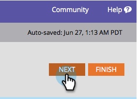

# 冠军／挑战者：完整电子邮件{#champion-challenger-whole-emails}

测试整个电子邮件。 测试结束后，发出最佳执行者。

>[!PREREQUISITES]
>
>* [添加电子邮件冠军／挑战者](add-an-email-champion-challenger.md)

>

1. 在电子邮件测试编辑器中，选择“**测试类型**”下拉列表中的“**完整电子邮件**”。

   

   >[!NOTE]
   >
   >记住：最初的电子邮件是冠军。 挑战者与它竞争。

1. 查找并选择&#x200B;**挑战者**&#x200B;电子邮件，然后单击&#x200B;**克隆**。

   

   >[!TIP]
   >
   >克隆可复制电子邮件测试中的挑战者电子邮件。

1. 拖动滑块，确定接收挑战者电子邮件与冠军电子邮件的人数百分比。

   

   >[!NOTE]
   >
   >**示例**
   >
   >
   >在上面显示的分发中，智能列表中指定的总受众的15%收到挑战者电子邮件，85%收到冠军电子邮件。 多封挑战者电子邮件的比例是15%。 测试结束后，您可以手动声明入选方。 从此以后，所有将来的人都会收到性能更好的内容。

   [关于统计信心的信息比以往任何时候都多](http://en.wikipedia.org/wiki/Confidence_interval)。

1. 单击&#x200B;**下一步**。

   

1. 进度！ 我们继续吧。

   >[!NOTE]
   >
   >**相关文章**
   >
   >    
   >    
   >    * [冠军／挑战者：定义冠军标准](champion-challenger-define-champion-criteria.md)

要获得统计信心，请确保分配给挑战者的百分比包含足够的人员，使您的测试有效。 别被无结果的结果所迷惑。