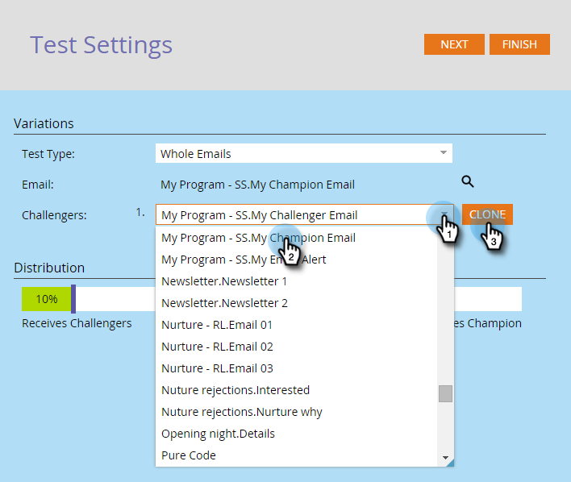

# 冠军/挑战者：整封电子邮件 {#champion-challenger-whole-emails}

测试整个电子邮件。 测试结束后，发出最佳执行者。

>[!PREREQUISITES]
>
>[添加电子邮件冠军/挑战者](/help/marketo/product-docs/email-marketing/general/functions-in-the-editor/email-tests-champion-challenger/add-an-email-champion-challenger.md)

1. 在电子邮件测试编辑器中，选择 **整封电子邮件** 在 **测试类型** 下拉菜单。

   

   >[!NOTE]
   >
   >请记住：原始电子邮件是冠军。 挑战者与它竞争。

1. 查找并选择 **挑战者** 电子邮件，然后单击 **克隆**.

   

   >[!TIP]
   >
   >克隆将复制电子邮件测试中的挑战者电子邮件。

1. 拖动滑块以确定接收挑战者电子邮件与冠军电子邮件的人员比例。

   

   >[!NOTE]
   >
   >**示例**
   >
   >在上面显示的分发中，15%的智能列表中指定的总受众会收到一封挑战电子邮件，85%的受众会收到冠军电子邮件。 多封挑战者电子邮件的比例均为15%。 测试结束后，您可以手动声明入选者。 从那以后，所有的未来人都会收到性能更好的内容。

   要获得统计置信度，请确保您分配给挑战者的百分比包含足够的人员，以便您的测试有效。 别被没有结果的结果蒙骗。

   [比您想要的更多有关统计置信度的信息](https://en.wikipedia.org/wiki/Confidence_interval).

1. 单击 **下一个**.

   

1. 进度! 我们继续吧。

   >[!MORELIKETHIS]
   >
   >[冠军/挑战者：定义冠军标准](/help/marketo/product-docs/email-marketing/general/functions-in-the-editor/email-tests-champion-challenger/champion-challenger-define-champion-criteria.md)
