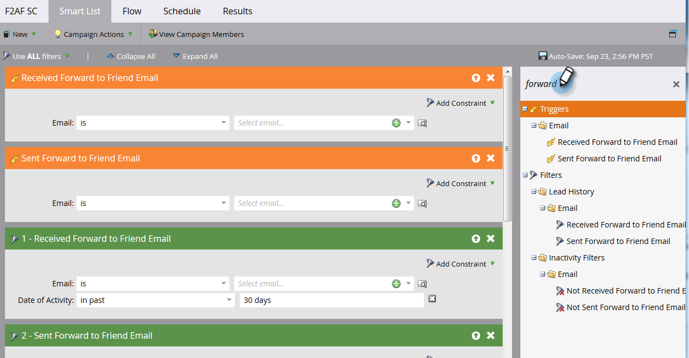

# 在电子邮件中转发到好友链接 {#forward-to-a-friend-link-in-emails}

通过将“转发到朋友”链接添加到您的电子邮件，您可以跟踪通过此链接收到转发电子邮件的用户，如果他们不在数据库中，则会自动将他们添加为新用户。

例如，假设Keith使用“转发给朋友”链接将电子邮件转发给未知的人Mark。 Mark会自动添加为新人员，被分配自己的Cookie，并且他的任何电子邮件和Web活动都与他关联。 但是，如果Keith在其电子邮件客户端中使用转发按钮，则Mark会被错误地将Cookie标记为Keith，而其活动将被记录为Keith的。

## 添加指向电子邮件模板的链接 {#add-the-link-to-an-email-template}

1. 转到 **Design Studio**.

   

1. 查找并选择要将链接添加到的电子邮件模板。 单击 **编辑草稿**.

   

1. 将以下HTML代码粘贴到要显示“转发给朋友”链接的位置（如果您在此部分需要帮助，请与Web开发人员协商）：

   `<pre data-theme="Confluence"><a href="{{system.forwardToFriendLink}}">Forward to Friend</a></pre>`

   

   >[!TIP]
   >
   >
   >您可以向链接添加样式，以使其看起来更好。 例如：
   >
   >`<a href="{{system.forwardToFriendLink}}" style="font-family:arial, sans-serif; padding:10px; position:absolute; right:0px;">Forward to Friend</a>`

   >[!CAUTION]
   >
   >我们不建议使用样式 **位置：相对** 中。 它可能会导致“转发给朋友”框的位置和显示问题。

1. 单击 **预览草稿** 以确保模板的外观符合您的要求。

   

   >[!NOTE]
   >
   >请记住批准模板草稿以应用更改。

   现在，所有使用该模板的电子邮件都将具有“转发给朋友”链接。 当电子邮件收件人单击该电子邮件时，他们将被带到电子邮件的Web版本，并显示“转发给朋友”框：

   

## 添加指向单个电子邮件的链接 {#add-the-link-to-an-individual-email}

您还可以直接将“转发到朋友”链接添加到电子邮件中。

1. 打开要在中包含链接的电子邮件，然后双击可编辑区域中的。

   

1. 将光标放在希望链接显示的位置并单击 **插入令牌** 按钮。

   

1. 选择 **`{{system.forwardToFriendLink}}`** 令牌。

   

   >[!NOTE]
   >
   >此令牌是Web版本的带“转发给朋友”框电子邮件的URL。

1. 写出您希望链接的显示文本的内容（例如，“转发给朋友”）。

   

1. 剪切 **`{{system.forwardToFriendLink}}`** 令牌。 选中“转发给朋友”，然后单击 **插入/编辑链接** 按钮。

   

1. 粘贴 **`{{system.forwardToFriendLink}}`** 令牌 **URL** 框中，然后单击 **插入**.

   

1. 保存编辑并预览新链接！

   

   >[!NOTE]
   >
   >默认情况下，通过接收“转发给朋友”电子邮件而添加的新用户会取消订阅营销电子邮件。

## 查看转发活动 {#view-forwarding-activity}

您可以在人员的活动日志中查看转发和接收电子邮件的用户。

1. 转到 **`Database`**.

   

1. 双击要查看其活动的人员。

   

1. 转到 **活动日志** 选项卡。 双击 **已接收转发给朋友的电子邮件** 或 **已发送到朋友的电子邮件** 以查看详细信息。

   

   >[!NOTE]
   >
   >**条件**
   >
   >对于“已转发给朋友”电子邮件，人员ID是转发该电子邮件的人员。
   >
   >对于“发送给朋友的电子邮件”，“人员ID”即是收到电子邮件的人员。

   

1. 要按ID查看人员，请复制并粘贴 **人员ID** 到URL的结尾(该URL的开头取决于您的Marketo实例):

   `<pre data-theme="Confluence">...marketo.com/Database/loadPersonDetail?personId=</pre>`

   >[!NOTE]
   >
   >我们会 **人员ID** 单击并直接链接到即将发布的修补程序中的人员。

   

   >[!NOTE]
   >
   >如果接收转发的朋友是未知的人员，则会创建一个新人员，其中“转发到朋友”标记为该人员的 **来源**.
   >如果电子邮件是项目的本地资产，则该项目将标记为人员的 **客户获取计划**.

## 使用转发活动触发器或进行过滤 {#trigger-or-filter-using-forwarding-activity}

您可以使用六个触发器/过滤器来触发流程操作，或通过发送和接收的“转发给朋友”活动来过滤人员。

在智能营销活动的智能列表中，如果您搜索“转发”，则会找到可用的触发器和过滤器。

## 测试转发给朋友 {#test-forward-to-friend}

要测试“转发给朋友”，请通过转发链接向您自己发送一封电子邮件。 确保通过 **发送电子邮件** 流量步骤， *not* 至 **发送测试电子邮件**.
