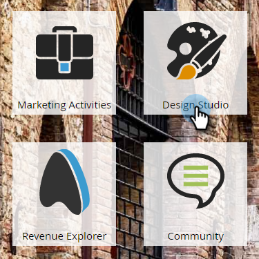
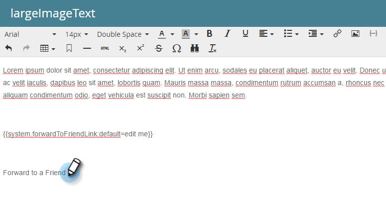

# 在电子邮件中转发到朋友链接 {#forward-to-a-friend-link-in-emails}

通过将“转发给朋友”链接添加到电子邮件，您可以跟踪通过此链接收到转发电子邮件的用户，如果数据库中尚不存在这些用户，则自动将其添加为新用户。

例如，假设Keith使用“转发给朋友”链接将电子邮件转发给未知人员Mark。 Mark会自动添加为新人员，并获得他自己的Cookie，他的任何电子邮件和Web活动都会关联到他。 但是，如果Keith在其电子邮件客户端中使用“转发”按钮，则Mark会错误地被编码为Keith，并且其活动会记录为Keith的。

## 添加指向电子邮件模板的链接 {#add-the-link-to-an-email-template}

1. 转到 **Design Studio**.

   

1. 查找并选择要为其添加链接的电子邮件模板。 单击 **编辑草稿**.

   

1. 将以下HTML代码粘贴到您希望显示“转发给朋友”链接的位置（如果您需要有关此部件的帮助，请咨询您的Web开发人员）：

   `<pre data-theme="Confluence"><a href="{{system.forwardToFriendLink}}">Forward to Friend</a></pre>`

   

   >[!TIP]
   >
   >
   >您可以为链接添加样式，使其外观更好看。 例如：
   >
   >`<a href="{{system.forwardToFriendLink}}" style="font-family:arial, sans-serif; padding:10px; position:absolute; right:0px;">Forward to Friend</a>`

   >[!CAUTION]
   >
   >我们不建议使用样式 **position：relative** 在电子邮件模板中。 这可能会导致“转发给朋友”框的位置和显示出现问题。

1. 单击 **预览草稿** 以确保模板与所需的样式一致。

   

   >[!NOTE]
   >
   >请记得批准模板草稿以应用更改。

   现在，使用该模板的所有电子邮件都将具有“转发给朋友”链接。 当电子邮件收件人单击时，将带他们查看电子邮件的Web版本，并显示“转发给朋友”框：

   

## 添加指向个人电子邮件的链接 {#add-the-link-to-an-individual-email}

您还可以将“转发给朋友”链接直接添加到电子邮件中。

1. 打开要包含该链接的电子邮件，并在可编辑区域中双击。

   

1. 将光标放在您希望链接出现的位置，然后单击 **插入令牌** 按钮。

   

1. 选择 **`{{system.forwardToFriendLink}}`** 令牌。

   

   >[!NOTE]
   >
   >此令牌是带有“转发给朋友”框的电子邮件Web版本的URL。

1. 写出您希望链接的显示文本的内容（例如，“转发给朋友”）。

   

1. 剪下 **`{{system.forwardToFriendLink}}`** 使用Ctrl+X (Windows)或Cmd+X (Mac)的令牌。 突出显示“转发给朋友”并单击 **插入/编辑链接** 按钮。

   

1. 粘贴 **`{{system.forwardToFriendLink}}`** 将令牌导入 **URL** 框中使用Ctrl/Cmd+V ，然后单击 **插入**.

   

1. 保存编辑并预览新链接！

   

   >[!NOTE]
   >
   >通过接收“转发给朋友”电子邮件添加的新用户默认情况下会取消订阅营销电子邮件。

## 查看转发活动 {#view-forwarding-activity}

您可以在用户的活动日志中查看转发和接收电子邮件的用户。

1. 转到 **`Database`**.

   

1. 双击要查看其活动的用户。

   

1. 转到 **活动日志** 选项卡。 双击 **已接收转发给朋友的电子邮件** 或 **转发给朋友的电子邮件** 查看详细信息。

   

   >[!NOTE]
   >
   >**条件**
   >
   >对于已接收的“转发给朋友”电子邮件，人员ID是转发电子邮件的人员。
   >
   >对于“转发给朋友”电子邮件，人员ID是接收电子邮件的人员。

   

1. 要按ID查看人员，请复制并粘贴 **人员ID** 到该URL的结尾(上述URL的开头将取决于您的Marketo实例)：

   `<pre data-theme="Confluence">...marketo.com/Database/loadPersonDetail?personId=</pre>`

   >[!NOTE]
   >
   >我们将做出 **人员ID** 点击，并直接链接到即将发布的修补程序中的人员。

   

   >[!NOTE]
   >
   >如果接收转发的朋友是未知人员，则会创建一个新人员，并标记该人员的“转发给朋友” **来源**.
   >如果电子邮件是项目的本地资产，则项目将标记为人员的 **客户获取计划**.

## 使用转发活动触发或过滤 {#trigger-or-filter-using-forwarding-activity}

共有六个触发器/过滤器可用于触发流量操作，或按已发送和已接收的“转发给朋友”活动过滤人员。

在智能营销活动的智能列表中，如果您搜索“转发”，则会找到可用的触发器和过滤器。

## 测试转发给朋友 {#test-forward-to-friend}

要测试“转发给朋友”，请给自己发送一封包含转发链接的电子邮件。 确保通过 **发送电子邮件** 流程步骤， *非* 到 **发送测试电子邮件**.
