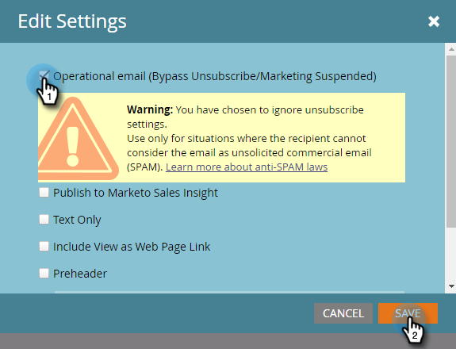

# 将电子邮件设为运营类 {#make-an-email-operational}

运营电子邮件忽略取消订阅和营销暂停状态。 他们也不受通信限制的约束。 无论如何他们都会发送。

>[!NOTE]
>
>运营电子邮件不计入通信限制。 例如，如果某人每周只能收到一封电子邮件，而您已经向他们发送了营销电子邮件，则您仍然可以在必要时向他们发送操作电子邮件。

1. 查找您的电子邮件，选择它并单击&#x200B;**[!UICONTROL Edit Draft]**。

>[!NOTE]
>
>您应仅将运营电子邮件用于关键电子邮件和自动响应者。 它们不适用于营销电子邮件。

1. 编辑器打开后，单击&#x200B;**[!UICONTROL Email Settings]**。

   

1. 检查&#x200B;**[!UICONTROL Operational Email]**&#x200B;并单击&#x200B;**[!UICONTROL Save]**。

   

>[!CAUTION]
>
>运营电子邮件不适合参与计划。 因此，参与计划将忽略电子邮件的操作状态。 与他们合作时，请记住这一点。

请别忘了批准此电子邮件，以使更改生效。 了解如何[批准电子邮件](/help/marketo/product-docs/email-marketing/general/creating-an-email/approve-an-email.md)。
