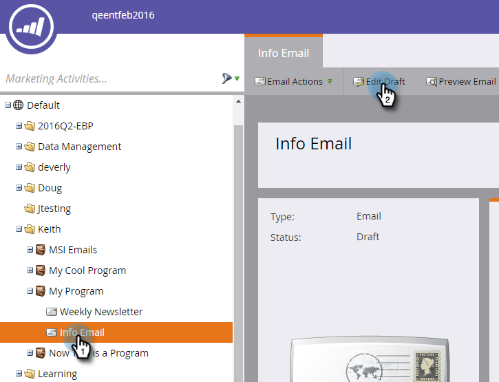
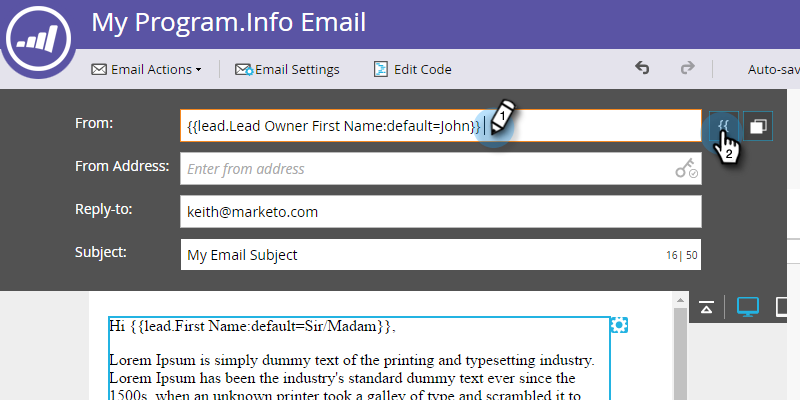

# 从潜在客户所有者发送电子邮件 {#send-emails-from-the-lead-owner}

如果要代表Lead Owner向Lead发送电子邮件，该怎么办？  具体方法如下。

1. 查找您的电子邮件，选择它并单击&#x200B;**[!UICONTROL Edit Draft]**。

   

1. 单击&#x200B;**[!UICONTROL From]**&#x200B;字段（删除任何现有名称），然后单击&#x200B;**插入令牌**&#x200B;按钮。

   

1. 开始键入“`{{lead.Lead Owner`”并选择&#x200B;**`{{lead.Lead Owner First Name}}`**&#x200B;令牌。

   

1. 输入默认值，以防潜在客户还没有潜在客户所有者，然后单击&#x200B;**[!UICONTROL Insert]**。

   

1. 在第一个令牌之后单击，添加空格，然后单击&#x200B;**插入令牌**&#x200B;按钮。

   

1. 开始键入“`{{lead.Lead Owner`”并选择&#x200B;**`{{lead.Lead Owner Last Name}}`**&#x200B;令牌。

   

1. 输入默认值，以防潜在客户还没有潜在客户所有者，然后单击&#x200B;**[!UICONTROL Insert]**。

   

   >[!TIP]
   >
   >确保在名字和姓氏令牌之间添加了空格。

1. 单击&#x200B;**[!UICONTROL From Address]**&#x200B;字段（删除任何现有的电子邮件地址），然后单击&#x200B;**插入令牌**&#x200B;按钮。

   

1. 开始键入“`{{lead.Lead Owner`”并选择&#x200B;**`{{lead.Lead Owner Email Address}}`**&#x200B;令牌。

   

1. 输入默认值，以防潜在客户还没有潜在客户所有者，然后单击&#x200B;**[!UICONTROL Insert]**。

   

1. 确保已填充&#x200B;**[!UICONTROL Reply-to]**&#x200B;和&#x200B;**[!UICONTROL Subject]**&#x200B;字段，并且您已完成！

   
