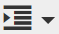
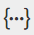

# 使用富文本编辑器 {#using-the-rich-text-editor}

富文本编辑器(RTE)会在整个Marketo中显示，并在您想要添加或编辑内容时可用。 您会在登陆页面、程序、电子邮件、表单和代码片段上看到此功能的某个版本。 只需单击 **编辑草稿**&#x200B;它会弹出来，为你服务。

## 编辑器设置 {#editor-settings}

根块元素设置定义将内容包裹在哪些标记中。 默认情况下，电子邮件根块元素使用 `
` 标记之间。 您可以选择按照以下步骤更改此设置。

>[!TIP]
>
>虽然您可以选择根块元素，但我们始终建议使用默认设置以获得最佳用户体验。

1. 单击 **管理员**.

   

1. 单击 **电子邮件**.

   

1. 单击 **编辑文本编辑器设置**.

   

1. 在 **电子邮件/代码片段编辑器** 下拉列表，选择 `
` 或无，然后单击 **保存**. `
` 在此示例中使用了。

   

   如果您拥有 `

` 在电子邮件模板中，当您打开部分并在编辑器中键入“Text Goes Here”时，您将看到以下HTML源行为：

<table> 
 <tbody> 
  <tr> 
   <th>&lt;p&gt;</th> 
   <th>&lt;div&gt;</th> 
   <th>无</th> 
  </tr> 
  <tr> 
   <td>
&lt;div class="“mktEditable”"&gt; &lt;p&gt;此处显示文本&lt;/p&gt; &lt;/div&gt;
</td> 
   <td>
&lt;div class="“mktEditable”"&gt; &lt;div&gt;此处显示文本&lt;/div&gt; &lt;/div&gt;
</td> 
   <td>
&lt;div class="“mktEditable”"&gt; 此处显示文本 &lt;/div&gt;
</td> 
  </tr> 
 </tbody> 
</table>

>[!TIP]
>
>您还可以按照相同步骤更改登陆页面编辑器的根块元素，但需单击 **登陆页面编辑器** 步骤4中的下拉列表，而不是电子邮件/代码片段编辑器。

>[!NOTE]
>
>根块元素始终为 `
` 用于富文本程序令牌。

## 功能 {#features}

以下是您在RTE中可以找到的功能。

| 图标 | 名称 | 作用 |
|---|---|---|
|  | 字体系列 | 选择您的风格 — 我们有足够多！ |
|  | 字体大小 | 你要多大？ 25种选择，从8px到90px。 |
|  | 样式 | 选择段落或六种标题样式（适用于登陆页面）。 |
|  | 行距 | 选取线条之间的距离。 |
|  | 文本颜色 | 黑色，红色，或者你想要的。 |
|  | 背景颜色 | 突出显示以强调重点。 |
|  | 粗体 | **较深且较厚**. |
|  | 斜体 | *斜角，用于强调或引用* s. |
|  | 下划线 | 在你的文字下面加一行。 |
|  | 对齐方式 | 使用此下拉菜单为文本和图像布局。 居中对齐，选择左对齐或右对齐，或沿边展开并完全对齐。 |  |  | 列表 | 从下拉菜单中选择项目符号或数字。 项目符号的好用在于包含步骤的列表和数字。 |
|  | 缩进 | 选择或多或少缩进。 用于段落或要脱颖而出的任何文本。 |
|  | 插入/编辑链接 | 放入指向网站或其他内容的链接；轻松对其进行更改。 |
|  | 插入/编辑图像 | 一张图片胜过千言万语。 放一个。 单击相机图标以浏览设计工作室。 您可以并排放置图像。 |
|  | 插入令牌 | 一款功能强大的工具，非常适用于电子邮件个性化和数据跟踪。 请确保输入默认值。 |
|  | 还原 | 糟糕！ 让我们返回上一步，再试一次。 |
|  | 重做 | 如果它确实没问题，请返回到原始。 |
|  | 表 | 建你自己的，像这个。 您可以通过下拉菜单进行配置。 |
|  | 插入锚点 | 放下锚点！ |
|  | 水平线 | 许多用途 — 非常适用于划分部分。 |
|  | 编辑HTML | 弹出HTML源编辑器，以便您调整代码。 |
|  | 下标 | 低悬字母(如O`2`)。 |
|  | 上标 | 你有力量！ (2`6`). |
|  | 删除线 | `<s>Put a line through text, like this</s>`. |
|  | 特殊字符 | 想聊聊欧元吗？ 数学？ 你有243个选择。 |
|  | 查找和替换 | 搜索并更改内容的速度比自己查找每个实例的速度快得多。 |
|  | 清除格式 | 将一切恢复正常。 |
|  | 取消 | 按下按钮说“没关系”。 |
|  | 保存 | 按下按钮以说：“OK，我喜欢它。” |

>[!TIP]
>
>可以在单独的屏幕上编辑HTML和文本。 请务必单击 **从HTML复制** 在 **文本** 选项卡，然后 **保存** 所以你的文字和你的HTML相符。

>[!NOTE]
>
>您不仅限于下拉列表中的字体。 您可以通过访问HTML代码来使用未列出的密码。 Marketo支持所有Web字体，但Web字体并非在所有电子邮件客户端中都通用。

## 登陆页面 {#landing-pages}

根块元素设置定义将内容包裹在哪些标记中。 默认情况下，登陆页面根块元素会使用 `
` 标记之间。 您可以选择按照以下步骤更改此设置。

>[!TIP]
>
>虽然您可以选择根块元素，但我们始终建议使用默认设置以获得最佳用户体验。

1. 单击 **管理员**.

   

1. 单击 **电子邮件**.

   

1. 单击 **编辑文本编辑器设置**.

   

1. 在 **登陆页面编辑器** 下拉列表，选择 `
` 或无，然后单击 **保存**. `
` 在此示例中使用了。

   

   就是这样！
