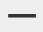

# 使用富文本编辑器 {#using-the-rich-text-editor}

富文本编辑器(RTE)会显示在整个Marketo中，并且无论您何时要添加或编辑内容，都可以使用。 您将在登陆页面、程序、电子邮件、表单和片段上看到其版本。 只需单击 **编辑草稿**，然后它会弹出来为您服务。

## 编辑器设置 {#editor-settings}

根块元素设置定义内容中包含的标记。 默认情况下，电子邮件根块元素会使用 `
` 标记。 您可以选择按照以下步骤进行更改。

>[!TIP]
>
>虽然您可以选择根块元素，但我们始终建议使用默认设置来获得最佳用户体验。

1. 单击 **管理员**.

   

1. 单击 **电子邮件**.

   

1. 单击 **编辑文本编辑器设置**.

   

1. 在 **电子邮件/代码片段编辑器** 下拉列表，选择 `
` 或“无”并单击 **保存**. `
` 在此示例中使用。

   

   如果 `

` 在电子邮件模板中，当您打开部分并在编辑器中键入“Text Goes Here”时，将看到以下HTML源行为：

<table> 
 <tbody> 
  <tr> 
   <th>&lt;p&gt;</th> 
   <th>&lt;div&gt;</th> 
   <th>无</th> 
  </tr> 
  <tr> 
   <td>
&lt;div class="“mktEditable”"&gt; &lt;p&gt;此处显示文本&lt;/p&gt; &lt;/div&gt;
</td> 
   <td>
&lt;div class="“mktEditable”"&gt; &lt;div&gt;此处显示文本&lt;/div&gt; &lt;/div&gt;
</td> 
   <td>
&lt;div class="“mktEditable”"&gt; 此处显示文本 &lt;/div&gt;
</td> 
  </tr> 
 </tbody> 
</table>

>[!TIP]
>
>您还可以按照相同的步骤更改登陆页面编辑器的根块元素，但是单击 **登陆页面编辑器** 下拉列表，而不是电子邮件/代码片段编辑器。

>[!NOTE]
>
>根块元素始终为 `
` 富文本程序令牌。

## 功能 {#features}

以下是RTE中的功能。

| 图标 | 名称 | 它的作用 |
|---|---|---|
|  | 字体系列 | 选择你的风格，我们有很多！ |
|  | 字体大小 | 你想要多大？ 25个选项，从8像素到90像素。 |
|  | 样式 | 选择“段落”或六种标题样式（用于登陆页面）。 |
|  | 行间距 | 选好线路之间的距离。 |
|  | 文本颜色 | 黑色，红色，或者你想要的。 |
|  | 背景颜色 | 突出显示以强调。 |
|  | 粗体 | **更暗、更厚**. |
|  | 斜体 | *成角度，用于强调或引用* s. |
|  | 下划线 | 在文本下放行。 |
|  | 对齐方式 | 使用此下拉菜单布局您的文本和图像。 将它们居中，选择左对齐或右对齐，或将边缘扩展到边缘，并使用完全对齐。 |  |  | 列表 | 从下拉菜单中选择项目符号或数字。 项目符号对列表和步骤编号很有用。 |
|  | 缩进 | 选择更多或更少缩进。 用于段落或任何要突出显示的文本。 |
|  | 插入/编辑链接 | 添加指向网站或其他内容的链接；轻松进行更改。 |
|  | 插入/编辑图像 | 一张画值一千字。 放一个进去。 单击相机图标以浏览您的Design Studio。 您可以并排放置图像。 |
|  | 插入令牌 | 一款功能强大的工具，非常适合进行电子邮件个性化和数据跟踪。 确保输入默认值。 |
|  | 撤消 | 啊！ 让你再回一步再试。 |
|  | 重做 | 如果真的没问题，请返回原始。 |
|  | 表 | 自己建，就象这个。 下拉菜单允许您对其进行配置。 |
|  | 插入锚点 | 放锚！ |
|  | 水平线 | 许多用法 — 非常适合划分部分。 |
|  | 编辑HTML | 弹出HTML源编辑器，以便您可以调整代码。 |
|  | 下标 | 低挂字母(如O中的`2`)。 |
|  | 上标 | 你有力量！ (2`6`). |
|  | 三振 | `<s>Put a line through text, like this</s>`. |
|  | 特殊字符 | 想谈谈欧元吗？ 数学？ 你有243个选择。 |
|  | 查找和替换 | 搜索和更改内容的速度比您自己查找每个实例的速度要快得多。 |
|  | 清除格式 | 将事项恢复为标准。 |
|  | 取消 | 按按钮说“没关系”。 |
|  | 保存 | 按按钮说，“好的，我喜欢它。” |

>[!TIP]
>
>您可以在不同的屏幕上编辑HTML和文本。 确保单击 **从HTML复制** 在 **文本** 选项卡，然后 **保存** 这样，您的文本就与您的HTML匹配。

>[!NOTE]
>
>下拉列表中的字体不限。 您可以使用未列出的代码，方法是访问HTML代码。 Marketo支持所有Web字体，但Web字体并非在所有电子邮件客户端中都能普遍使用。

## 登陆页面 {#landing-pages}

根块元素设置定义内容中包含的标记。 默认情况下，登陆页面根块元素会使用 `
` 标记。 您可以选择按照以下步骤进行更改。

>[!TIP]
>
>虽然您可以选择根块元素，但我们始终建议使用默认设置来获得最佳用户体验。

1. 单击 **管理员**.

   

1. 单击 **电子邮件**.

   

1. 单击 **编辑文本编辑器设置**.

   

1. 在 **登陆页面编辑器** 下拉列表，选择 `
` 或“无”并单击 **保存**. `
` 在此示例中使用。

   

   就这样！
