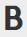

# 使用富文本编辑器 {#using-the-rich-text-editor}

富文本编辑器(RTE)会在整个Marketo中显示，并在您想要添加或编辑内容时可用。 您会在登陆页面、程序、电子邮件、表单和代码片段上看到此功能的某个版本。 只需单击&#x200B;**[!UICONTROL Edit Draft]**，它就会弹出，为您提供服务。

## 编辑器设置 {#editor-settings}

根块元素设置定义将内容包裹在哪些标记中。 默认情况下，电子邮件根块元素使用`
`标记。 您可以选择按照以下步骤更改此设置。

>[!TIP]
>
>虽然您可以选择根块元素，但我们始终建议使用默认设置以获得最佳用户体验。

1. 单击 **[!UICONTROL Admin]**。

   

1. 单击 **[!UICONTROL Email]**。

   

1. 单击 **[!UICONTROL Edit Text Editor Settings]**。

   

1. 在&#x200B;**[!UICONTROL Email]/[!UICONTROL Snippet Editor]**&#x200B;下拉列表中，选择`
`或[!UICONTROL None]，然后单击&#x200B;**[!UICONTROL Save]**。 在此示例中使用了`
`。

   

   如果电子邮件模板中包含`

`，则在打开部分并在编辑器中键入“Text Goes Here”时，您将看到以下HTML Source行为：

<table>
 <tbody>
  <tr>
   <th>&lt;p&gt;</th>
   <th>&lt;div&gt;</th>
   <th>None</th>
  </tr>
  <tr>
   <td>
&lt;div class="mktEditable"&gt; &lt;p&gt;此处显示文本&lt;/p&gt; &lt;/div&gt;
</td>
   <td>
&lt;div class="mktEditable"&gt; &lt;div&gt;此处显示文本&lt;/div&gt; &lt;/div&gt;
</td>
   <td>
&lt;div class="mktEditable"&gt; 此处显示文本 &lt;/div&gt;
</td>
  </tr>
 </tbody>
</table>

>[!TIP]
>
>您也可以按照相同的步骤更改登陆页面编辑器的根块元素，但需在步骤4中单击&#x200B;**[!UICONTROL Landing Page Editor]**&#x200B;下拉列表而不是[!UICONTROL Email] / [!UICONTROL Snippet Editor]。

>[!NOTE]
>
>富文本程序令牌的根块元素始终为`
`。

## 功能 {#features}

以下是您在RTE中可以找到的功能。

| 图标 | 名称 | 作用 |
|---|---|---|
|  | [!UICONTROL Font Family] | 选择您的风格 — 我们有足够多！ |
|  | [!UICONTROL Font Size] | 你要多大？ 25种选择，从8px到90px。 |
|  | [!UICONTROL Styles] | 选择段落或六种标题样式（适用于登陆页面）。 |
|  | [!UICONTROL Line Spacing] | 选取线条之间的距离。 |
|  | [!UICONTROL Text Color] | 黑色，红色，或者你想要的。 |
|  | [!UICONTROL Background Color] | 突出显示以强调重点。 |
|  | [!UICONTROL Bold] | **较深且较厚**。 |
|  | [!UICONTROL Italic] | *为强调或引号*&#x200B;而倾斜。 |
|  | [!UICONTROL Underline] | 在你的文字下面加一行。 |
|  | [!UICONTROL Alignment] | 使用此下拉菜单为文本和图像布局。 居中对齐，选择左对齐或右对齐，或沿边展开并完全对齐。 |  |  | 列表 | 从下拉菜单中选择项目符号或数字。 项目符号的好用在于包含步骤的列表和数字。 |
|  | [!UICONTROL Indent] | 选择或多或少缩进。 用于段落或要脱颖而出的任何文本。 |
|  | [!UICONTROL Insert/Edit Link] | 放入指向网站或其他内容的链接；轻松对其进行更改。 |
|  | [!UICONTROL Insert/Edit Image] | 一张图片胜过千言万语。 放一个。 单击相机图标以浏览设计工作室。 您可以并排放置图像。 |
|  | [!UICONTROL Insert Token] | 一款功能强大的工具，非常适用于电子邮件个性化和数据跟踪。 请确保输入默认值。 |
|  | [!UICONTROL Undo] | 糟糕！ 让我们返回上一步，再试一次。 |
|  | [!UICONTROL Redo] | 如果它确实没问题，请返回到原始。 |
|  | [!UICONTROL Table] | 建你自己的，像这个。 您可以通过下拉菜单进行配置。 |
|  | [!UICONTROL Insert Anchor] | 放下锚点！ |
|  | [!UICONTROL Horizontal Line] | 许多用途 — 非常适用于划分部分。 |
|  | [!UICONTROL Edit HTML] | 弹出HTML Source编辑器，以便您调整代码。 |
|  | [!UICONTROL Subscript] | 低悬字母（如O`2`）。 |
|  | [!UICONTROL Superscript] | 你有力量！ (2`6`)。 |
|  | [!UICONTROL Strikethrough] | `<s>Put a line through text, like this</s>`。 |
|  | [!UICONTROL Special Character] | 想聊聊欧元吗？ 数学？ 你有243个选择。 |
|  | [!UICONTROL Find and Replace] | 搜索并更改内容的速度比自己查找每个实例的速度快得多。 |
|  | [!UICONTROL Clear Formatting] | 将一切恢复正常。 |
|  | [!UICONTROL Cancel] | 按下按钮说“没关系”。 |
|  | [!UICONTROL Save] | 按下按钮以说：“OK，我喜欢它。” |

>[!TIP]
>
>可以在单独的屏幕上编辑HTML和文本。 请确保单击&#x200B;**[!UICONTROL Copy from HTML]**&#x200B;选项卡上的&#x200B;**[!UICONTROL Text]**，然后单击&#x200B;**[!UICONTROL Save]**，以使您的文本与您的HTML匹配。

>[!NOTE]
>
>您不仅限于下拉列表中的字体。 您可以通过访问HTML代码来使用未列出的代码。 Marketo支持所有Web字体，但Web字体并非在所有电子邮件客户端中都通用。

## 登陆页面 {#landing-pages}

根块元素设置定义将内容包裹在哪些标记中。 默认情况下，登陆页面根块元素使用`
`标记。 您可以选择按照以下步骤更改此设置。

>[!TIP]
>
>虽然您可以选择根块元素，但我们始终建议使用默认设置以获得最佳用户体验。

1. 单击 **[!UICONTROL Admin]**。

   

1. 单击 **[!UICONTROL Email]**。

   

1. 单击 **[!UICONTROL Edit Text Editor Settings]**。

   

1. 在&#x200B;**[!UICONTROL Landing Page Editor]**&#x200B;下拉列表中，选择`
`或[!UICONTROL None]，然后单击&#x200B;**[!UICONTROL Save]**。 在此示例中使用了`
`。

   

   就是这样！
