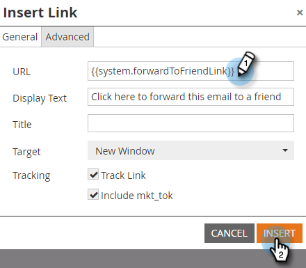

# 将系统令牌添加为电子邮件中的链接 {#add-a-system-token-as-a-link-in-an-email}

您可以使用这些系统令牌自定义特殊链接在电子邮件中的位置。

以下令牌可用作电子邮件或电子邮件模板中的链接：

* `{{system.forwardToFriendLink}}`
* `{{system.unsubscribeLink}}`
* `{{system.viewAsWebpageLink}}`

>[!NOTE]
>
>除非在锚点 **链接** 内，否则这些令牌将不可单击。 而且，它们 **不能** 嵌入到我的令牌中。

下面介绍如何将它们添加到电子邮件：

1. 查找并选择您的电子邮件，然后单击“ **编辑草稿”**。

   

1. 多次在可编辑区域中单击。

   

1. 高亮显示要转换为将包含标记的链接的文本，然后单击“插入/ **编辑链接** ”按钮。

   

1. 在链接URL中输入令牌，然后单击 **插入**。

   

   >[!TIP]
   >
   >复制／粘贴所需的令牌： **`{{system.forwardToFriendLink}}`** 或 **`{{system.unsubscribeLink}}`** 者 **`{{system.viewAsWebpageLink}}`**

1. 单击 **保存**。

   

>[!NOTE]
>
>**提醒**
>
>完成后，不要忘 [记批准您的](../../../../product-docs/email-marketing/general/creating-an-email/approve-an-email.md) 电子邮件。

干得好！ 现在您了解如何将系统令牌添加为电子邮件中的链接。