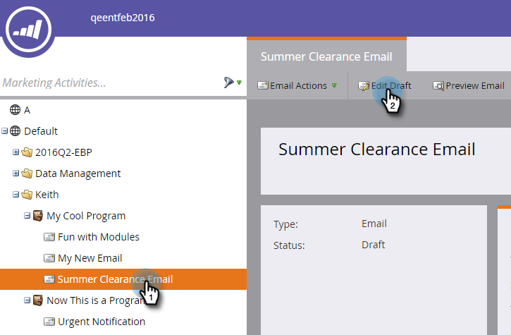

# 向电子邮件链接添加令牌 {#add-tokens-to-an-email-link}

要将其他参数和特定于人员的参数插入链接，您可以使用令牌。 操作方法如下：

1. 选择您的电子邮件并单击&#x200B;**[!UICONTROL Edit Draft]**&#x200B;选项卡。

   

1. 双击可编辑区域。

   

1. 查找或写入链接的文本。 突出显示它，然后单击&#x200B;**[!UICONTROL Insert/Edit Link]**&#x200B;图标。

   

1. 在&#x200B;**[!UICONTROL URL]**&#x200B;中键入所需的令牌并单击&#x200B;**[!UICONTROL Insert]**。

   

1. 单击 **[!UICONTROL Save]**。

   

>[!MORELIKETHIS]
>
>[在我的令牌中使用URL](/help/marketo/product-docs/email-marketing/general/using-tokens/using-urls-in-my-tokens.md)
