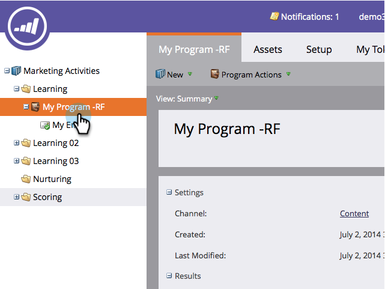

# 创建电子邮件脚本令牌 {#create-an-email-script-token}

对于高级开发人员，您可以使用 [Velocity脚本](https://velocity.apache.org/engine/1.7/user-guide.html) 在电子邮件中。 下面是操作方法。

1. 转到 **营销活动**.

   

1. 查找并选择任意项目（事件、默认或参与等）。

   

1. 在 **我的令牌** 选项卡，拖入 **电子邮件脚本** 令牌。

   

1. 命名您的电子邮件脚本令牌，并 **单击以编辑** 其内容。

   

1. 使用右侧的树以拖入 **人员，机会**，或 **自定义对象** 令牌。

   

   >[!NOTE]
   >
   >访问数组（商机或自定义对象）时，您将受限于与人员关联的最近10个项目。

1. 请注意，将令牌拖到脚本编辑器后，该令牌会变为选中/活动状态。

   

   >[!NOTE]
   >
   >如果您以自由格式键入令牌，请确保检查/激活树中所有相应的令牌，否则这些令牌将被视为纯文本并且不起作用。

1. 在Velocity中编写脚本。 以下是一些有用的资源：

   * [Marketo开发人员电子邮件脚本文档](https://developers.marketo.com/email-scripting/)
   * [Velocity用户指南](https://velocity.apache.org/engine/devel/user-guide.html)
   * [Velocity参考指南](https://velocity.apache.org/engine/devel/vtl-reference-guide.html)
   * [Velocity工具Javadoc](https://velocity.apache.org/tools/releases/2.0/javadoc/index.html)

1. 脚本完成后，单击 **保存**.

   

1. 单击 **保存** 再来一次。

   

现在，您可以在电子邮件中使用此令牌。 每次发送电子邮件时，它都会运行脚本。

>[!MORELIKETHIS]
>
>[向电子邮件添加电子邮件脚本令牌](/help/marketo/product-docs/email-marketing/general/using-tokens/add-an-email-script-token-to-your-email.md)
