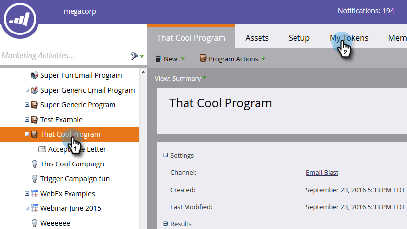

# 使用我的令牌{#using-urls-in-my-tokens}中的URL

请按照以下步骤使用我的令牌将URL插入您的电子邮件中。

1. 选择您的项目，然后单击&#x200B;**我的令牌**。

   

1. 选择&#x200B;**文本**&#x200B;我的令牌，将其拖放到画布上。

   

1. 为标记指定唯一名称，输入URL(不带https://)，然后单击&#x200B;**保存**。

   

   >[!CAUTION]
   >
   >要确保在您的电子邮件中跟踪点击，请在令牌的值中输入&#x200B;**not**。

1. 在您的项目中选择电子邮件。

   

1. 单击&#x200B;**编辑草稿**。

   

1. 多次在要编辑的文本区域中单击。

   

1. 在电子邮件的任意位置，键入“https://”（在之后不留空格）并单击“插入令牌”图标。

   

   >[!NOTE]
   >
   >当然，如果您的站点使用“https”，您也可以选择输入它。

1. 找到您的My Token，选择它，然后单击&#x200B;**插入**。

   

1. 高亮显示https://和标记，然后按Ctrl/Cmd+X(Ctrl = Windows/Cmd = Mac)以剪切文本。

   

1. 突出显示要显示链接的文本，然后单击“插入/编辑链接”图标。

   

1. 按Ctrl/Cmd+V可将内容粘贴到&#x200B;**URL**&#x200B;框中，然后单击&#x200B;**插入**。

   

1. 单击&#x200B;**保存**。

   

   你完了！ 您的URL将在发送后填充，并且由于您将https://放在令牌前面，它将生成可跟踪的链接。
