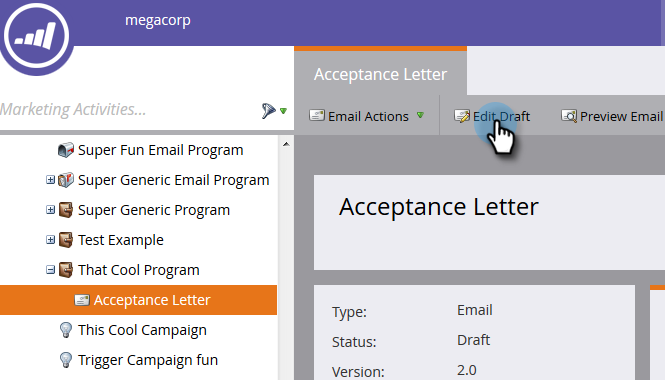

# 在我的令牌中使用URL {#using-urls-in-my-tokens}

按照以下步骤使用“我的令牌”将URL插入到您的电子邮件中。

1. 选择您的项目并单击 **我的令牌**.

   

1. 选择 **文本** 我的令牌，拖放到画布上。

   

1. 为令牌指定唯一的名称，输入URL(不带https://)并单击 **保存**.

   

   >[!CAUTION]
   >
   >要确保跟踪电子邮件中的点击量，请执行 **非** 在令牌值中输入https:// 。

1. 选择程序中的电子邮件。

   

1. 单击 **编辑草稿**.

   

1. 双击文本区域以进行编辑。

   

1. 在电子邮件中的任意位置，键入“https://”（后面不留空格）并单击“插入令牌”图标。

   

   >[!NOTE]
   >
   >如果您的网站使用“https”，您当然也可以选择输入“https”。

1. 找到您的“我的令牌”，选择它，然后单击 **插入**.

   

1. 突出显示https://和令牌，然后按Ctrl/Cmd+X (Ctrl = Windows/Cmd = Mac)以剪切文本。

   

1. 突出显示您希望链接显示的文本，然后单击插入/编辑链接图标。

   

1. 按Ctrl/Cmd+V将内容粘贴到 **URL** 框并单击 **插入**.

   

1. 单击 **保存**.

   

   你完蛋了！ 您的URL将在发送后填充，由于您将https://放在令牌的前面，它将生成一个可跟踪链接。
