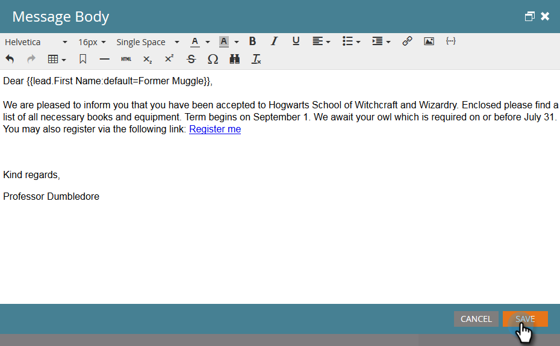

# 在我的令牌中使用URL {#using-urls-in-my-tokens}

请按照以下步骤使用我的令牌将URL插入电子邮件中。

1. 选择您的程序并单击 **我的令牌**.

   

1. 选择 **文本** 我的令牌，将其拖放到画布上。

   

1. 为令牌指定唯一名称，输入URL(不带https://)并单击 **保存**.

   

   >[!CAUTION]
   >
   >要确保在电子邮件中跟踪点击，请执行 **not** 在令牌值中输入https:// 。

1. 在您的项目中选择电子邮件。

   

1. 单击 **编辑草稿**.

   

1. 双击要编辑的文本区域。

   

1. 在电子邮件中的任意位置，键入“https://”（之后不留空格）并单击插入令牌图标。

   

   >[!NOTE]
   >
   >当然，如果您的网站使用“https”，您还可以选择输入“https”。

1. 找到您的令牌，将其选中，然后单击 **插入**.

   

1. 突出显示https://和令牌，然后按Ctrl/Cmd+X(Ctrl = Windows/Cmd = Mac)以剪切文本。

   

1. 突出显示您希望链接显示的文本，然后单击插入/编辑链接图标。

   

1. 按Ctrl/Cmd+V将内容粘贴到 **URL** 框，单击 **插入**.

   

1. 单击 **保存**.

   

   你完蛋了！ 发送后，您的URL将会填充，由于您将https://放置在令牌前面，因此它将生成一个可跟踪的链接。
