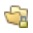

# 图标术语表 {#new-icon-glossary}

以下是新Adobe Marketo Engage界面的图标。 如果您需要引用Marketo Classic图标，它们可以 [在此处找到](/help/marketo/getting-started/classic-icon-glossary.md).

## 常规图标 {#general-icons}

<table> 
 <tbody>
  <tr>
   <th>旧图标</th> 
   <th> 新建图标</th> 
   <th>描述</th> 
  </tr>
  <tr>
   <td><strong>不适用</strong></td> 
   <td></td> 
   <td>帐户智能列表</td> 
  </tr>
  <tr>
   <td></td> 
   <td></td> 
   <td>批次营销活动 — 活动</td> 
  </tr>
  <tr>
   <td></td> 
   <td></td> 
   <td>批次营销活动 — 不活动</td> 
  </tr>
  <tr>
   <td></td> 
   <td></td> 
   <td>默认项目群</td> 
  </tr>
  <tr>
   <td></td> 
   <td></td> 
   <td>电子邮件</td> 
  </tr>
  <tr>
   <td></td>
   <td></td> 
   <td>电子邮件程序</td> 
  </tr>
  <tr>
   <td></td> 
   <td></td> 
   <td>电子邮件模板</td> 
  </tr>
  <tr>
   <td></td> 
   <td></td> 
   <td>参与计划</td> 
  </tr>
  <tr>
   <td></td> 
   <td></td> 
   <td>活动计划</td> 
  </tr>
  <tr>
   <td></td> 
   <td></td> 
   <td>可执行的营销活动</td> 
  </tr>
  <tr>
   <td></td> 
   <td></td> 
   <td>字段管理器</td> 
  </tr>
  <tr>
   <td></td> 
   <td></td> 
   <td>筛选器</td> 
  </tr>
  <tr>
   <td><strong>不适用</strong></td> 
   <td></td> 
   <td>筛选器 — 活动</td> 
  </tr>
  <tr>
   <td></td> 
   <td></td> 
   <td>文件夹</td> 
  </tr>
  <tr>
   <td></td> 
   <td></td> 
   <td>文件夹 — 已存档</td> 
  </tr>
  <tr>
   <td></td> 
   <td></td> 
   <td>文件夹 — 已锁定</td> 
  </tr>
  <tr>
   <td></td> 
   <td></td> 
   <td>表单</td> 
  </tr>
  <tr>
   <td></td> 
   <td></td> 
   <td>图像（和文件）</td> 
  </tr>
  <tr>
   <td></td> 
   <td></td> 
   <td>应用程序内消息</td> 
  </tr>
  <tr>
   <td></td> 
   <td></td> 
   <td>应用程序内程序</td> 
  </tr>
  <tr>
   <td></td> 
   <td></td> 
   <td>登陆页面</td> 
  </tr>
  <tr>
   <td></td> 
   <td></td> 
   <td>登陆页面模板</td> 
  </tr>
  <tr>
   <td></td> 
   <td></td> 
   <td>模型</td> 
  </tr>
  <tr>
   <td></td> 
   <td></td> 
   <td>投票</td> 
  </tr>
  <tr>
   <td></td> 
   <td></td> 
   <td>推送通知</td> 
  </tr>
  <tr>
   <td></td> 
   <td></td> 
   <td>推荐优惠</td> 
  </tr>
  <tr>
   <td></td> 
   <td></td> 
   <td>报告</td> 
  </tr>
  <tr>
   <td><strong>不适用</strong></td> 
   <td></td> 
   <td>搜索</td> 
  </tr>
  <tr>
   <td></td> 
   <td></td> 
   <td>区段</td> 
  </tr>
  <tr>
   <td></td> 
   <td></td> 
   <td>智能列表</td> 
  </tr>
  <tr>
   <td></td> 
   <td></td> 
   <td>智能列表 — 已缓存</td> 
  </tr>
  <tr>
   <td></td> 
   <td></td> 
   <td>SMS消息</td> 
  </tr>
  <tr>
   <td></td> 
   <td></td> 
   <td>代码片段</td> 
  </tr>
  <tr>
   <td></td> 
   <td></td> 
   <td>社交按钮</td> 
  </tr>
  <tr>
   <td></td> 
   <td></td> 
   <td>静态列表</td> 
  </tr>
  <tr>
   <td></td> 
   <td></td> 
   <td>抽奖活动</td> 
  </tr>
  <tr>
   <td></td> 
   <td></td> 
   <td>测试组</td> 
  </tr>
  <tr>
   <td></td> 
   <td></td> 
   <td>触发器 — 活动</td> 
  </tr>
  <tr>
   <td><strong>不适用</strong></td> 
   <td></td> 
   <td>触发器 — 不活动</td> 
  </tr>
  <tr>
   <td></td> 
   <td></td> 
   <td>工作区</td> 
  </tr>
  <tr>
   <td></td> 
   <td></td> 
   <td>YouTube视频</td> 
  </tr>
 </tbody>
</table>

## 批量活动 {#batch-campaigns}

<table> 
 <tbody>
  <tr>
   <th>旧图标</th> 
   <th> 新建图标</th> 
   <th>描述</th> 
  </tr>
  <tr>
   <td></td> 
   <td></td> 
   <td>已运行，没有即将运行</td> 
  </tr>
  <tr>
   <td></td> 
   <td></td> 
   <td>无效</td> 
  </tr>
  <tr>
   <td></td> 
   <td></td> 
   <td>从不运行</td> 
  </tr>
  <tr>
   <td></td> 
   <td></td> 
   <td>正在运行，在等待步骤中</td> 
  </tr>
  <tr>
   <td></td> 
   <td></td> 
   <td>已计划运行</td> 
  </tr>
  <tr>
   <td></td> 
   <td></td> 
   <td>已计划再次运行</td> 
  </tr>
  <tr>
   <td></td> 
   <td></td> 
   <td>由Nurture使用</td> 
  </tr>
 </tbody>
</table>

## 触发活动 {#trigger-campaigns}

<table> 
 <tbody>
  <tr>
   <th>旧图标</th> 
   <th> 新建图标</th> 
   <th>描述</th> 
  </tr>
  <tr>
   <td></td> 
   <td></td> 
   <td>活跃</td> 
  </tr>
  <tr>
   <td></td> 
   <td></td> 
   <td>已请求</td> 
  </tr>
  <tr>
   <td><strong>不适用</strong></td> 
   <td></td> 
   <td>不活跃</td> 
  </tr>
  <tr>
   <td></td> 
   <td></td> 
   <td>无效</td> 
  </tr>
 </tbody>
</table>

## 电子邮件程序 {#email-programs}

<table> 
 <tbody>
  <tr>
   <th>旧图标</th> 
   <th> 新建图标</th> 
   <th>描述</th> 
  </tr>
  <tr>
   <td></td> 
   <td></td> 
   <td>已中止</td> 
  </tr>
  <tr>
   <td></td> 
   <td></td> 
   <td>已完成</td> 
  </tr>
  <tr>
   <td></td> 
   <td></td> 
   <td>未批准</td> 
  </tr>
  <tr>
   <td></td> 
   <td></td> 
   <td>已安排</td> 
  </tr>
 </tbody>
</table>

## 参与计划 {#engagement-programs}

<table> 
 <tbody>
  <tr>
   <th>旧图标</th> 
   <th> 新建图标</th> 
   <th>描述</th> 
  </tr>
  <tr>
   <td></td> 
   <td></td> 
   <td>关闭</td> 
  </tr>
  <tr>
   <td></td> 
   <td></td> 
   <td>于</td> 
  </tr>
 </tbody>
</table>

## 应用程序内程序 {#in-app-programs}

<table> 
 <tbody>
  <tr>
   <th>旧图标</th> 
   <th> 新建图标</th> 
   <th>描述</th> 
  </tr>
  <tr>
   <td></td> 
   <td></td> 
   <td>已批准</td> 
  </tr>
  <tr>
   <td></td> 
   <td></td> 
   <td>尚未配置</td> 
  </tr>
  <tr>
   <td></td> 
   <td></td> 
   <td>已暂停</td> 
  </tr>
  <tr>
   <td><strong>不适用</strong></td> 
   <td></td> 
   <td>已安排</td> 
  </tr>
  <tr>
   <td></td> 
   <td></td> 
   <td>已停止</td> 
  </tr>
 </tbody>
</table>

## 资产 {#assets}

<table> 
 <tbody>
  <tr>
   <th>旧图标</th> 
   <th> 新建图标</th> 
   <th>描述</th> 
  </tr>
  <tr>
   <td></td> 
   <td></td> 
   <td>已批准</td> 
  </tr>
  <tr>
   <td></td> 
   <td></td> 
   <td>草稿</td> 
  </tr>
  <tr>
   <td></td> 
   <td></td> 
   <td>已审批，草稿</td> 
  </tr>
 </tbody>
</table>

## 区段 {#segments}

<table> 
 <tbody>
  <tr>
   <th>旧图标</th> 
   <th> 新建图标</th> 
   <th>描述</th> 
  </tr>
  <tr>
   <td><strong>不适用</strong></td> 
   <td></td> 
   <td>已批准 — 正在计算中</td> 
  </tr>
  <tr>
   <td><strong>不适用</strong></td> 
   <td></td> 
   <td>已批准 — 正在重新计算</td> 
  </tr>
  <tr>
   <td><strong>不适用</strong></td> 
   <td></td> 
   <td>草稿 — 正在计算中</td> 
  </tr>
 </tbody>
</table>
