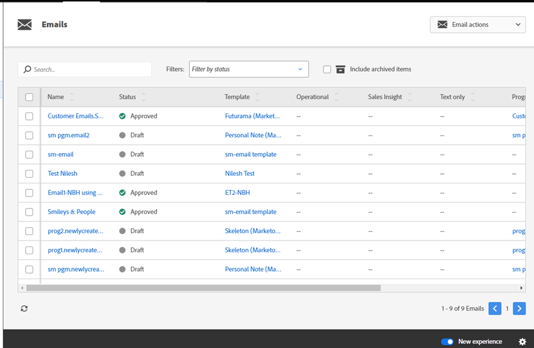

# 切换开关 {#toggle-switch}

通过切换开关，您可以在Marketo的经典界面和现代UX之间切换。 它可以在下面所有强调的区域中使用。

>[!NOTE]
>
>如果选择了切换开关，则所有现有工作流将在发生UI更改之前自动保存。 如果操作已在进行中（例如：资产正在批准过程中），您将收到一条错误消息，指示此类操作，应在操作完成后重试。

## 为各个角色启用切换开关 {#enable-the-toggle-switch-for-individual-roles}

为单个角色或所有角色启用切换开关。 具体方法如下。

1. 在Marketo Engage中，单击 **管理员**.

   

1. 单击 **新体验**.

   

1. 选择要访问切换开关的角色。

   

## 为功能启用 {#enable-for-features}

您可以选择手动为各个功能或所有可用功能（当前和即将推出的功能）启用Marketo EngageModern UX。

在当前具有切换开关的区域中（在本例中，我们位于电子邮件列表视图中），只需单击页面右下方的切换开关即可。

将加载新体验。

要为以下项启用它 _所有_ 特征时，单击切换开关旁边的齿轮图标。

选择 **为所有可用功能启用** 并单击 **确定**.

## 可用功能 {#available-features}

目前，Modern UX中提供以下功能（在每个版本中添加了新功能）：

* 电子邮件详细信息视图
* 电子邮件列表视图
* 电子邮件模板详细信息视图
* 电子邮件模板列表
* 电子邮件测试仪表板视图
* 表单详细信息视图
* 表单列表视图
* “图像和文件详细资料”页
* 登陆页面详细信息视图
* 登陆页面列表视图
* 登陆页面模板详细信息
* 登陆页面模板列表
* 代码片段详细信息视图
* 代码片段列表视图

