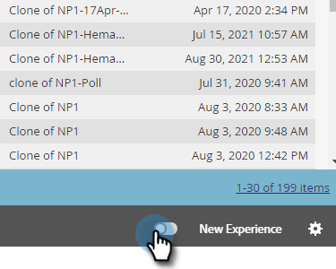

# 切换开关 {#toggle-switch}

切换开关允许您在Marketo的经典界面和下一代Marketo Engage体验之间切换。 它适用于下面重点介绍的所有区域。

>[!NOTE]
>
>选择切换开关后，所有现有的工作流都将在UI发生更改之前自动保存。 如果操作已在进行中(例如：资产正在获得批准)，您将收到一条错误消息，指示如此，并应在操作完成后重试。

## 为各个角色启用切换开关 {#enable-the-toggle-switch-for-individual-roles}

为单个角色或所有角色启用切换开关。 这是方法。

1. 在Marketo Engage中，单击 **管理员**.

   

1. 单击 **新体验**.

   

1. 选择您希望有权访问切换开关的角色。

   

## 启用功能 {#enable-for-features}

您可以选择手动为Marketo的下一代界面启用单个功能，或为所有可用功能（当前和即将推出）启用。

在当前具有切换开关的区域（在本例中，我们位于“电子邮件列表视图”中）中，只需单击页面右下方的切换开关。

将加载新体验。

为 _全部_ 功能中，单击切换开关旁边的齿轮图标。

选择 **启用所有可用功能** 单击 **确定**.

## 可用功能 {#available-features}

Marketo的下一代界面当前提供以下功能（每个版本都新增了新功能）：

* “电子邮件详细信息”视图
* 电子邮件列表视图
* “电子邮件模板详细信息”视图
* 电子邮件测试功能板视图
* 表单详细信息视图
* 表单列表视图
* “图像和文件详细信息”页
* 登陆页面详细信息视图
* 登陆页面列表视图
* 代码片段详细信息视图
