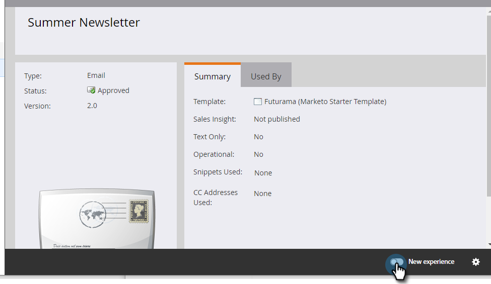

# 切换开关 {#toggle-switch}

切换开关允许您在Marketo的经典界面和下一代Marketo Engage体验之间切换。 它适用于下面重点介绍的所有区域。 自2022年5月版起，默认情况下将启用下一代体验。

>[!NOTE]
>
>选择切换开关后，所有现有的工作流都将在UI发生更改之前自动保存。 如果操作已在进行中(例如：资产正在获得批准)，您将收到一条错误消息，指示如此，并应在操作完成后重试。

## 为各个角色启用切换开关 {#enable-the-toggle-switch-for-individual-roles}

为单个角色或所有角色启用切换开关。 这是方法。

1. 在Marketo Engage中，单击 **管理员**.

   

1. 单击 **新体验**.

   

1. 选择您希望有权访问切换开关的角色。

   

## 登陆页面列表视图 {#landing-page-list-view}

下一代登陆页面列表视图提供了搜索过滤器以及执行批量登陆页面操作的功能。

1. 在Marketo中，选择 **Design Studio**.

   

1. 选择 **登陆页面**.

   

1. 在页面的右下方，单击 **新体验** 切换。

   

将加载新体验。

## 登陆页面详细信息视图 {#landing-page-details-view}

1. 在Marketo中，找到并选择您的登陆页面。

   

1. 在页面的右下方，单击 **新体验** 切换。

   

将加载新体验。

## 表单详细信息页面 {#form-details-page}

1. 在Marketo中，查找并选择您的表单。

   

1. 在页面的右下方，单击 **新体验** 切换。

   

将加载新体验。

## 表单列表视图 {#form-list-view}

1. 在Marketo中，选择 **Design Studio**.

   

1. 选择 **Forms**.

   

1. 在页面的右下方，单击 **新体验** 切换。

   

将加载新体验。

## “电子邮件模板详细信息”视图 {#email-template-details-view}

1. 在Marketo中，选择 **Design Studio**.

   

1. 选择所需的电子邮件模板。

   

1. 在页面的右下方，单击 **新体验** 切换。

   

将加载新体验。

## “电子邮件详细信息”视图 {#email-details-view}

1. 在Marketo中，找到并选择您的电子邮件。

   

1. 在页面的右下方，单击 **新体验** 切换。

   

将加载新体验。

## 电子邮件列表视图 {#email-list-view}

下一代电子邮件列表视图提供搜索过滤器以及执行批量电子邮件操作的功能。

1. 在Marketo中，选择 **Design Studio**.

   

1. 选择 **电子邮件**.

   

1. 在页面的右下方，单击 **新体验** 切换。

   

将加载新体验。

## 为所有功能启用 {#enable-for-all-features}

您可以选择手动启用Marketo的下一代界面，以获取所有可用功能（当前和即将提供）。

1. 在当前具有切换开关的区域(在本例中，我们位于 [表单详细信息页面](#form-details-page))，请单击页面右下方的齿轮图标。

   

1. 选择 **启用所有可用功能** 单击 **确定**.

   
