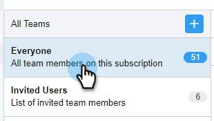

# 创建子团队 {#create-a-sub-team}

## 创建子团队 {#create-a-sub-team-1}

1. 单击齿轮图标并选择 **设置**.

   

1. 在管理设置下，选择 **团队管理**.

   

1. 在“所有团队”旁边，单击 **+**.

   

1. 输入团队名称（和可选说明），然后单击 **创建**.

   

   >[!NOTE]
   >
   >您现在可以与该团队共享模板、营销活动和组。

## 将人员添加到您的子团队 {#add-people-to-your-sub-team}

1. 仍然在团队管理中，选择 **每个人** 组。

   

1. 找到要添加到子团队中的用户，然后选中其复选框。

   

1. 单击 **将选定项添加到团队**.

   

1. 单击下拉列表，然后选择所需的团队。

   

1. 单击 **添加到团队** 完成时。

   
