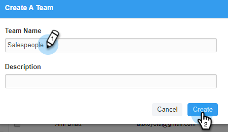
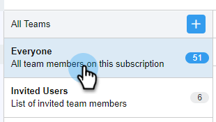
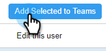
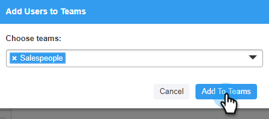

# 创建子团队 {#create-a-sub-team}

## 创建子团队 {#create-a-sub-team-1}

1. 单击齿轮图标并选择&#x200B;**[!UICONTROL Settings]**。

   

1. 在[!UICONTROL Admin Settings]下，选择&#x200B;**[!UICONTROL Team Management]**。

   

1. 在[!UICONTROL All Teams]旁边，单击&#x200B;**+**。

   

1. 输入团队名称（和可选描述）并单击&#x200B;**[!UICONTROL Create]**。

   

   >[!NOTE]
   >
   >您现在可以与该团队共享模板、营销活动和组。

## 将人员添加到您的子团队 {#add-people-to-your-sub-team}

1. 仍在[!UICONTROL Team Management]中，选择&#x200B;**[!UICONTROL Everyone]**&#x200B;组。

   

1. 找到要添加到子团队中的用户，然后选中其复选框。

   

1. 单击 **[!UICONTROL Add Selected to Teams]**。

   

1. 单击下拉列表，然后选择所需的团队。

   

1. 完成后，单击 **[!UICONTROL Add To Teams]**。

   
